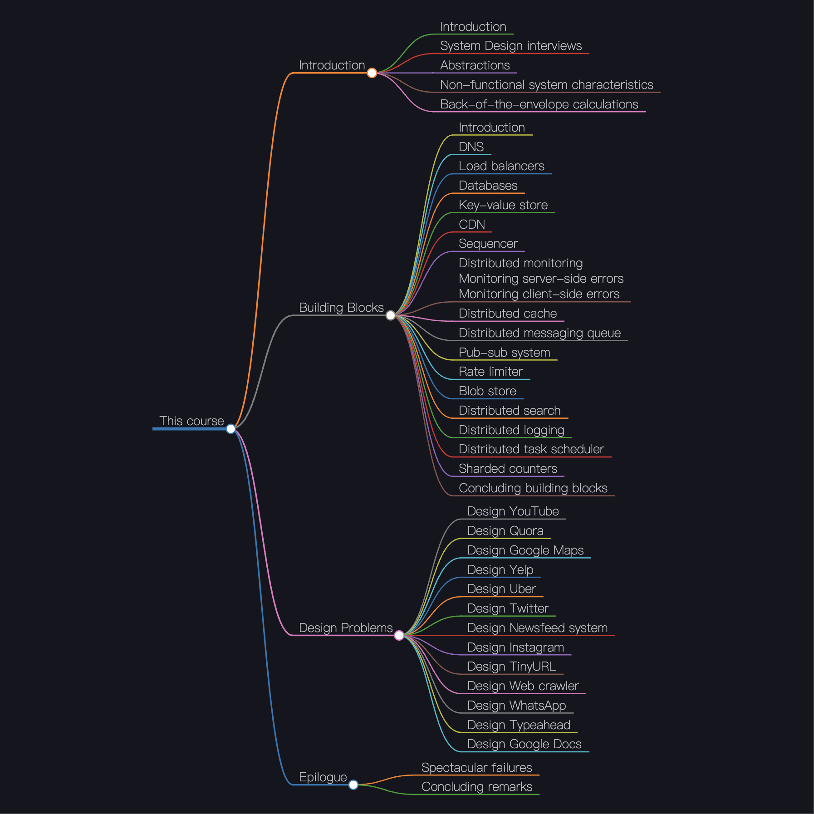
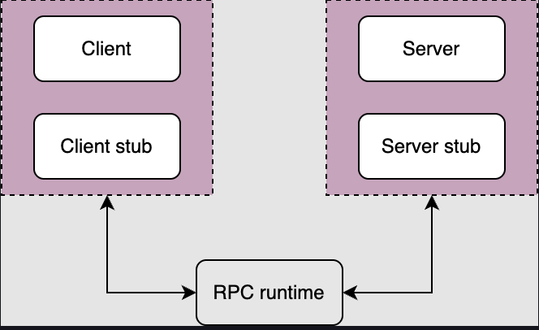
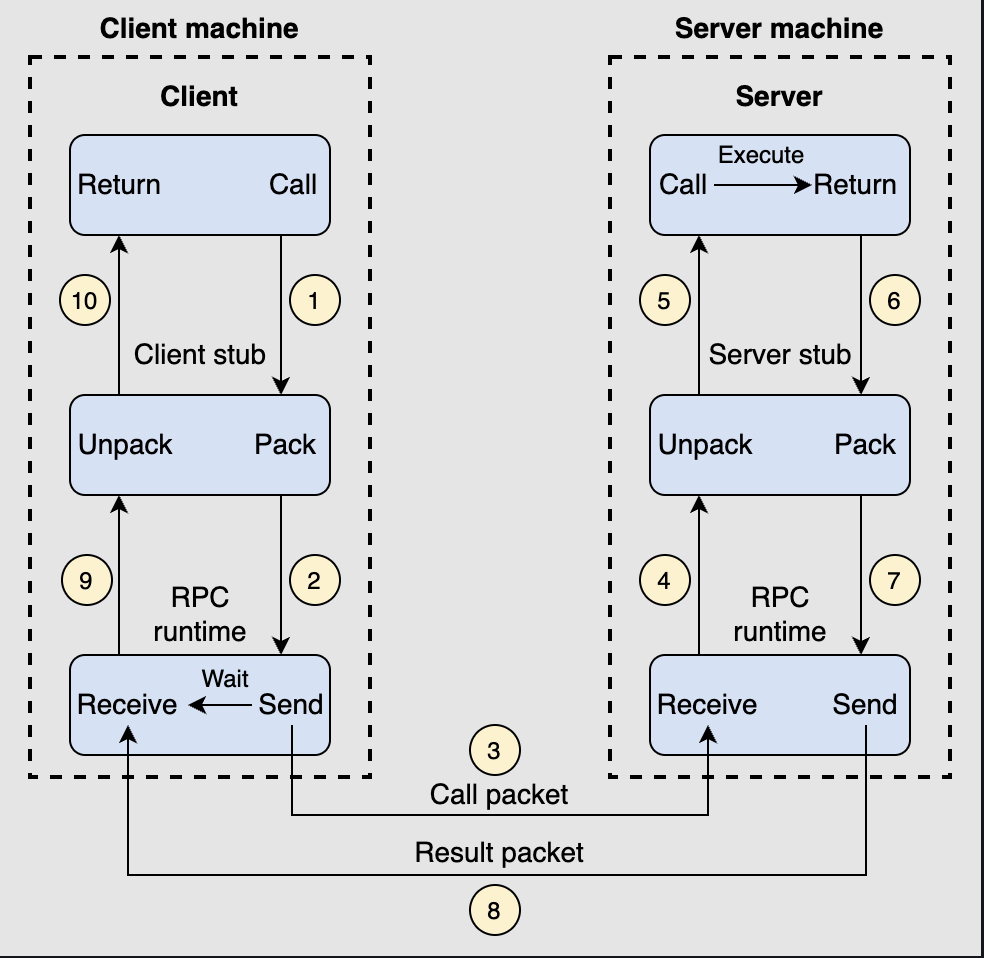

# Intro
 

# SDI
1. Solify the requirements
2. Scope the problem
3. Engage the interviewer 

# Abstraction
## RPC
Remote procedure calls (RPCs) provide an abstraction of a local procedure call to the developers by hiding the complexities of packing and sending function arguments to the remote server, receiving the return values, and managing any network retries. 

### Common RPC Frameworks
- gRPC
- Thrift（Facebook）

### Terminology
- **ClientStub**: The client stub is a client-side proxy that provides the same procedure as the server-side procedure. The client stub is responsible for packaging the parameters of the procedure into a message and sending it to the server. 和原生程序工作在一个线程进程中，只是负责处理序列化和反序列化、网络通信、负载均衡、故障处理等任务隐藏底层细节。
- **ServerStub**: The server stub is a server-side proxy that provides the same procedure as the client-side procedure. The server stub is responsible for unpacking the message, taking the parameters out of it, and calling the desired server routine, using a local procedure call, to do the required execution.
- **RPC Runtime**: The RPC runtime is a library that provides the client and server stubs. It is responsible for packaging the parameters of the procedure into a message and sending it to the server. It also receives the message from the server and unpacks it, taking the parameters out of it, and calling the desired server routine, using a local procedure call, to do the required execution. The RPC runtime also provides the necessary support for the client and server stubs to communicate over the network.一般来说工作在同一线程进程中，负责序列化和反序列化、网络通信、负载均衡、故障处理等任务。

### RPC Workflow

1. A client initiates a client stub process by giving parameters as normal. The client stub is stored in the address space of the client.
2. The client stub converts the parameters into a standardized format and packs them into a message. After packing the parameter into a message, the client stub requests the local RPC runtime to deliver the message to the server.
3. The RPC runtime at the client delivers the message to the server over the network. After sending a message to the server, it waits for the message result from the server.
4. RPC runtime at the server receives the message and passes it to the server stub.
5. The server stub unpacks the message, takes the parameters out of it, and calls the desired server routine, using a local procedure call, to do the required execution.
6. After the server routine has been executed with the given parameters, the result is returned to the server stub.
The server stub packs the returned result into a message and sends it to the RPC runtime at the server on the transport layer.
7. The server’s RPC runtime returns the packed result to the client’s RPC runtime over the network.
8. The client’s RPC runtime that was waiting for the result now receives the result and sends it to the client stub.
9. The client stub unpacks the result, and the execution process returns to the caller at this point.

### RPC vs REST
- RPC is more efficient than REST because it uses a binary format instead of JSON(文本格式) to send data.（Server Clent端紧密绑定，也具有更好的安全约束）
- REST is more flexible than RPC. REST is not tied to any particular protocol(建议使用HTTP， 但并不绑定，RPC框架一般有严格的底层协议选择), but RPC is tightly coupled with the underlying protocol.简单易用，拥有广泛社区支持 

#### Scenarios for using RPC:

1. Emphasizing performance and efficiency: If your application requires high performance, low latency, and high throughput remote calls, RPC may be more suitable. RPC typically uses binary protocols with lower overhead and higher performance.

2. Cross-language support: If your system needs to support multiple programming languages and requires convenient cross-language remote calls, RPC may be more suitable. RPC frameworks often provide cross-language support, enabling seamless communication between applications in different languages.

3. Rich data type support: If your application needs to transmit complex data types and structures and requires strict type checking and validation, RPC may be more suitable. RPC frameworks often provide strong interface definitions and support for rich data types.

#### Scenarios for using REST:

1. Web development and internet scenarios: If your application is web-based, and you need to expose APIs for client access or build internet-facing services, REST may be more suitable. REST is a fundamental building block of the web, with widespread support and ecosystems.

2. Simplicity and ease of use: If you need a simple and easy-to-use communication approach, and prefer resource interaction through URLs and HTTP verbs (such as GET, POST, PUT, DELETE), REST may be more suitable.

3. Loose coupling and flexibility: If you require a loosely coupled communication approach without strong dependencies between clients and servers, allowing for easy scalability and evolution, REST may be more suitable.

