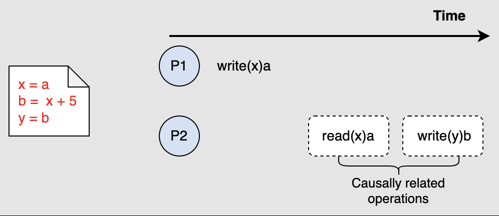

# Spectrum of Consistency Models

## Consistency Models
- There is a difference between consistency in ACID properties and consistency in the CAP theorem. In ACID, consistency means that a transaction can only bring the database from one valid state to another, maintaining database invariants: any data written to the database must be valid according to all defined rules.

- CAP Consistency: Every replica of the same logical value has the same precise value at all times. It’s worth noting that this is a logical rather than a physical guarantee. Due to the speed of light, replicating numbers throughout a cluster may take some time. By preventing clients from accessing different values at separate nodes, the cluster can nevertheless give a logical picture. Every read receiving the most recent write or an error. In other words, reads are guaranteed to return the latest write or an error.

1. Eventual Consistency
Eventual consistency is the weakest consistency model. The applications that don’t have strict ordering requirements and don’t require reads to return the latest write choose this model. Eventual consistency ensures that all the replicas will eventually return the same value to the read request, but the returned value isn’t meant to be the latest value. However, the value will finally reach its latest state. Eventual consistency ensures high availability.

Ex: The domain name system is a highly available system that enables name lookups to a hundred million devices across the Internet. It uses an eventual consistency model and doesn’t necessarily reflect the latest values.Cassandra is a highly available NoSQL database that provides eventual consistency.

2. Casual Consistency
Causal consistency works by categorizing operations into dependent and independent operations. Dependent operations are also called causally-related operations. Causal consistency preserves the order of the causally-related operations.

In the following illustration, process P1 writes a value a at location x. For P2 to write the value b at location y, it first needs to calculate b. Since b=x+5, the read operation on x should be performed before writing b on location y. That’s why read(x)a and write(y)b are causally related.

This model doesn’t ensure ordering for the operations that are not causally related. These operations can be seen in different possible orders.

Causal consistency is weaker overall, but stronger than the eventual consistency model. It’s used to prevent non-intuitive behaviors.

Ex: The causal consistency model is used in a commenting system. For example, for the replies to a comment on a Facebook post, we want to display comments after the comment it replies to. This is because there is a cause-and-effect relationship between a comment and its replies.

3. Sequential consistency
Sequential consistency is stronger than the causal consistency model. It preserves the ordering specified by each client’s program. However, sequential consistency doesn’t ensure that the writes are visible instantaneously or in the same order as they occurred according to some global clock.

Example

In social networking applications, we usually don’t care about the order in which some of our friends’ posts appear. However, we still anticipate a single friend’s posts to appear in the correct order in which they were created). Similarly, we expect our friends’ comments in a post to display in the order that they were submitted. The sequential consistency model captures all of these qualities.
Ex 顾客a在服务员a点餐，顾客b在服务员b点餐，全局时间谁先点单谁就应该拿到咖啡

4. Linearizability
A strict consistency or linearizability is the strongest consistency model. This model ensures that a read request from any replicas will get the latest write value. Once the client receives the acknowledgment that the write operation has been performed, other clients can read that value.

Linearizability is challenging to achieve in a distributed system. Some of the reasons for such challenges are variable network delays and failures. The following slides show depicts how variable network delays make it possible for different parties to see different values.

Usually, synchronous replication is one of the ingredients for achieving strong consistency, though it in itself is not sufficient. We might need consensus algorithms such as Paxos and Raft to achieve strong consistency.

Linearizability affects the system’s availability, which is why it’s not always used. Applications with strong consistency requirements use techniques like quorum-based replication to increase the system’s availability.

Example

Updating an account’s password requires strict consistency. For example, if we suspect suspicious activity on our bank account, we immediately change our password so that no unauthorized users can access our account. If it were possible to access our account using an old password due to a lack of strict consistency, then changing passwords would be a useless security strategy.Amazon Aurora provides strong consistency.

Linearizable services appear to carry out transactions/operations in sequential, real-time order. They make it easier to create suitable applications on top of them by limiting the number of values that services can return to application processes.

Linearizable services have worse performance rates than services with weaker consistency in exchange for their strong assurances. Think about a read in a key-value store that returns the value written by a concurrent write. The read imposes no limits on future reads if the key-value store is weakly consistent.

Application programmers have to compromise performance and availability if they use services with strong consistency models. The models may break the invariants of applications built on top of them in exchange for increased performance.

