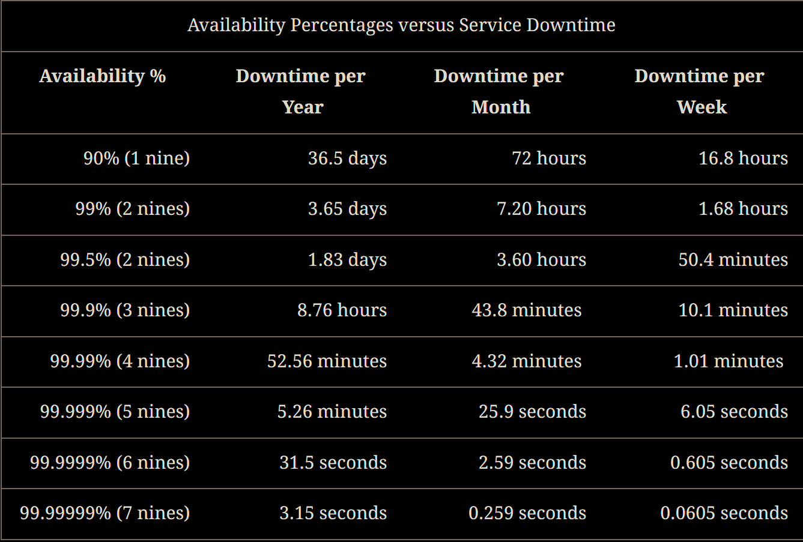
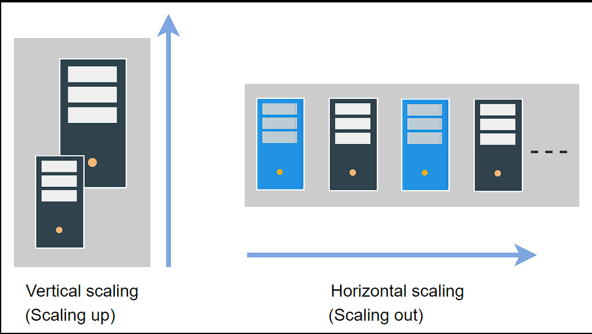

# Non-functional System Characteristics
## Availablity
Availability is the percentage of time that some service or infrastructure is accessible to clients and is operated upon under normal conditions. For example, if a service has 100% availability, it means that the said service functions and responds as intended (operates normally) all the time.
(TotalTime - DownTime)/TotalTime * 100

## Reliability
Reliability, R, is the probability that the service will perform its functions for a specified time. R measures how the service performs under varying operating conditions.
We often use mean time between failures (MTBF) and mean time to repair (MTTR) as metrics to measure R. 

- MTBF:Totol (Elapsed Time - Sum of Downtime)/ Total number of failure
- MTTR:Total Maintance time / Total number of repairs 

Reliability and availability are two important metrics to measure compliance of service to agreed-upon service level objectives (SLO).

The measurement of availability is driven by time loss, whereas the frequency and impact of failures drive the measure of reliability. Availability and reliability are essential because they enable the stakeholders to assess the health of the service.

Reliability (R) and availability (A) are two distinct concepts, but they are related. Mathematically, A is a function of R. This means that the value of R can change independently, and the value of A depends on R. Therefore, it’s possible to have situations where we have:
  
## Scalability
Scalability is the ability of a system to handle an increasing amount of workload without compromising performance. A search engine, for example, must accommodate increasing numbers of users, as well as the amount of data it indexes.

The workload can be of different types, including the following:
- Request workload: This is the number of requests served by the system.
- Data/storage workload: This is the amount of data stored by the system.
  
### Different approaches of scalability
- Vertical Scalability(scale up)
Vertical scaling, also known as “scaling up,” refers to scaling by providing additional capabilities (for example, additional CPUs or RAM) to an existing device. Vertical scaling allows us to expand our present hardware or software capacity, but we can only grow it to the limitations of our server. The dollar cost of vertical scaling is usually high because we might need exotic components to scale up.
- Horizontal scalability(scaling out)
Horizontal scaling, also known as “scaling out,” refers to increasing the number of machines in the network. We use commodity nodes for this purpose because of their attractive dollar-cost benefits. The catch here is that we need to build a system such that many nodes could collectively work as if we had a single, huge server.

## Maintainability
Besides building a system, one of the main tasks afterward is keeping the system up and running by finding and fixing bugs, adding new functionalities, keeping the system’s platform updated, and ensuring smooth system operations. One of the salient features to define such requirements of an exemplary system design is maintainability. We can further divide the concept of maintainability into three underlying aspects: 
1. Operability: This is the ease with which we can ensure the system’s smooth operational running under normal circumstances and achieve normal conditions under a fault.
2. Lucidity: This refers to the simplicity of the code. The simpler the code base, the easier it is to understand and maintain it, and vice versa.
3. Modifiability: This is the capability of the system to integrate modified, new, and unforeseen features without any hassle.
   
Maintainability, M, is the probability that the service will restore its functions within a specified time of fault occurrence. M measures how conveniently and swiftly the service regains its normal operating conditions.

For example, suppose a component has a defined maintainability value of 95% for half an hour. In that case, the probability of restoring the component to its fully active form in half an hour is 0.95.We use (mean time to repair) MTTR as the metric to measure M.

MTTR = Total Maintance time / Total number of repairs

In other words, MTTR is the average amount of time required to repair and restore a failed component. Our goal is to have as low a value of MTTR as possible.

Maintainability can be defined more clearly in close relation to reliability. The only difference between them is the variable of interest. Maintainability refers to time-to-repair, whereas reliability refers to both time-to-repair and the time-to-failure. Combining maintainability and reliability analysis can help us achieve availability, downtime, and uptime insights.

## Fault Tolerance
Real-world, large-scale applications run hundreds of servers and databases to accommodate billions of users’ requests and store significant data. These applications need a mechanism that helps with data safety and eschews the recalculation of computationally intensive tasks by avoiding a single point of failure. 

Fault tolerance refers to a system’s ability to execute persistently even if one or more of its components fail. Here, components can be software or hardware. Conceiving a system that is hundred percent fault-tolerant is practically very difficult.

### Fault Tolerance Techniques
#### Replication  

One of the most widely-used techniques is replication-based fault tolerance. With this technique, we can replicate both the services and data. We can swap out failed nodes with healthy ones and a failed data store with its replica. A large service can transparently make the switch without impacting the end customers. 

We create multiple copies of our data in separate storage. All copies need to update regularly for consistency when any update occurs in the data. Updating data in replicas is a challenging job. When a system needs strong consistency, we can synchronously update data in replicas. However, this reduces the availability of the system. We can also asynchronously update data in replicas when we can tolerate eventual consistency, resulting in stale reads until all replicas converge. Thus, there is a trade-off between both consistency approaches. We compromise either on availability or on consistency under failures—a reality that is outlined in the CAP theorem.

#### Checkpointing
Checkpointing is a technique that saves the system’s state in stable storage when the system state is consistent. Checkpointing is performed in many stages at different time intervals. The primary purpose is to save the computational state at a given point. When a failure occurs in the system, we can get the last computed data from the previous checkpoint and start working from there.

Checkpointing also comes with the same problem that we have in replication. When the system has to perform checkpointing, it makes sure that the system is in a consistent state, meaning that all processes are stopped except read processes that do not change the state of the system. This type of checkpointing is known as synchronous checkpointing. On the other hand, checkpointing in an inconsistent state leads to data inconsistency problems. Let’s look at the illustration below to understand the difference between a consistent and an inconsistent state:

Consistent state: The illustration above shows no communication among the processes when the system performs checkpointing. All the processes are sending or receiving messages before and after checkpointing. This state of the system is called a consistent state.

Inconsistent state: The illustration also displays that processes communicate through messages when the system performs checkpointing. This indicates an inconsistent state, because when we get a previously saved checkpoint, Process i will have a message (m1) and Process j will have no record of message sending.

