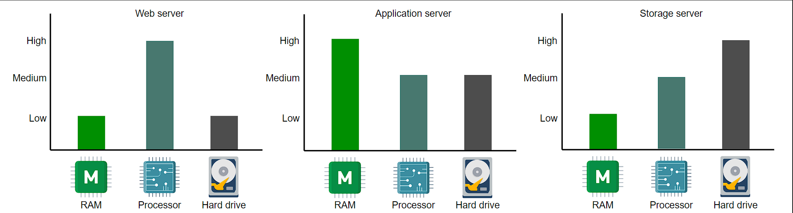
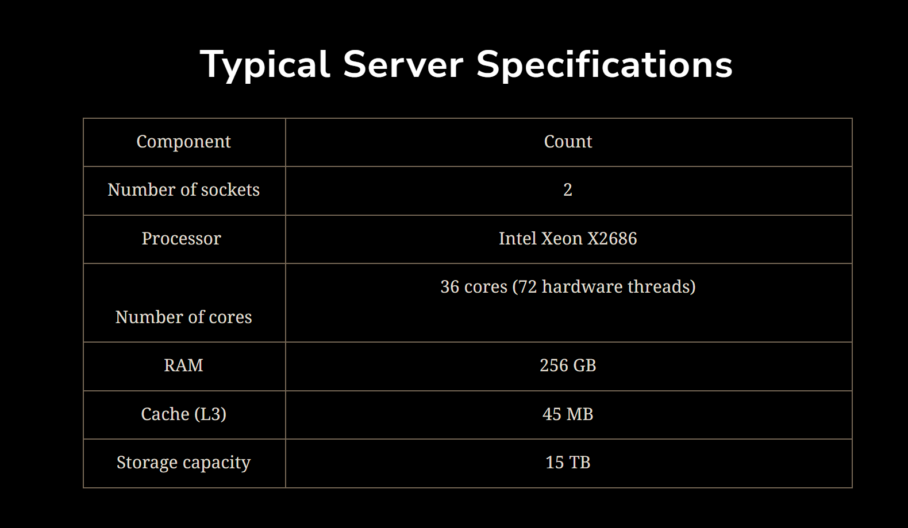
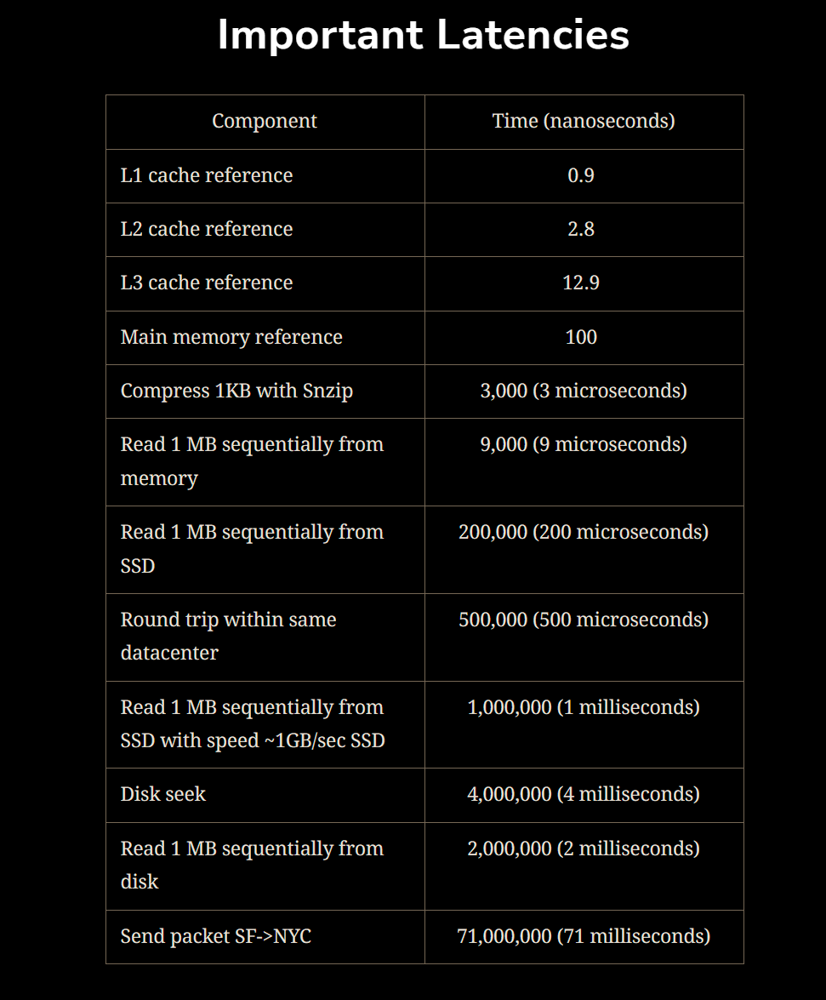
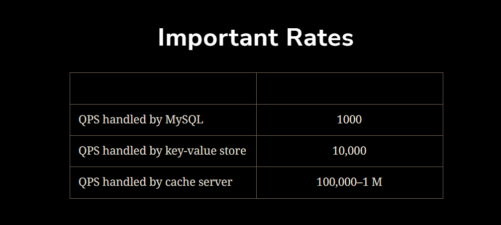
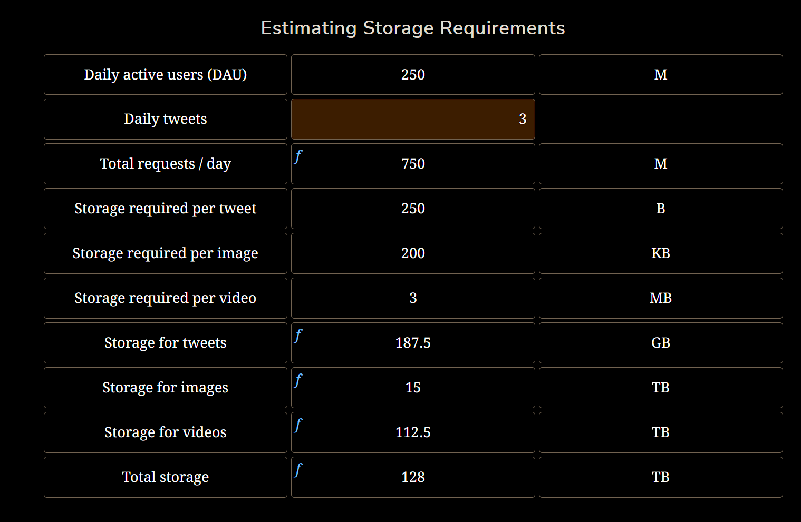
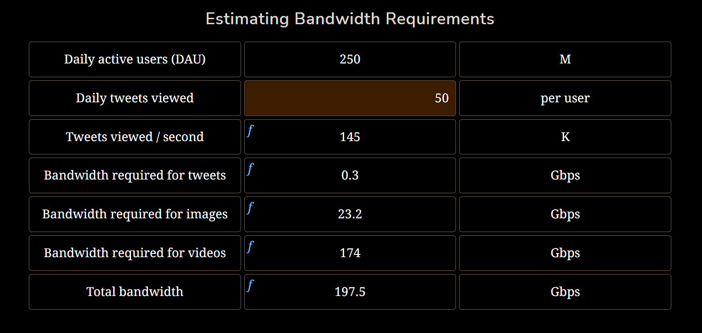

# Put Back-of-the-envelope Numbers in Perspective
A distributed system has compute nodes connected via a network. There’s a wide variety of available compute nodes and they can be connected in many different ways. Back-of-the-envelope calculations help us ignore the nitty-gritty details of the system (at least at the design level) and focus on more important aspects.

Some examples of a back-of-the-envelope calculation could be:
- The number of concurrent TCP connections a server can support.
- The number of requests per second (RPS) a web, database, or cache server can handle.
- The storage requirements of a service.

## Type of data center servers
Data centers don’t have a single type of server. Enterprise solutions use commodity hardware to save cost and develop scalable solutions. Below, we discuss the types of servers that are commonly used within a data center to handle different workloads.

### Web servers
For scalability, the web servers are decoupled from the application servers. Web servers are the first point of contact after load balancers. Data centers have racks full of web servers that usually handle API calls from the clients. Depending on the service that’s offered, the memory and storage resources in web servers can be small to medium. However, such servers require good computational resources. For example, Facebook has used a web server with 32 GB of RAM and 500 GB of storage space. But for its high-end computational needs, it partnered with Intel to build a custom 16-core processor.

### Application servers
Application servers run the core application software and business logic. The difference between web servers and application servers is somewhat fuzzy. Application servers primarily provide dynamic content, whereas web servers mostly serve static content to the client, which is mostly a web browser. They can require extensive computational and storage resources. Storage resources can be volatile and non-volatile. Facebook has used application servers with a RAM of up to 256 GB and two types of storage—traditional rotating disks and flash—with a capacity of up to 6.5 TB.

### Storage servers
With the explosive growth of Internet users, the amount of data stored by giant services has multiplied. Additionally, various types of data are now being stored in different storage units. For instance, YouTube uses the following datastores:
- Blob storage for its encoded videos.
- A temporary processing queue storage that can hold a few hundred hours of video content uploaded daily to YouTube for processing.
- Specialized storage called Bigtable for storing a large number of thumbnails of videos.
- Relational database management system (RDBMS) for users and videos metadata (comments, likes, user channels, and so on).
  
Other data stores are still used for analytics—for example, Hadoop’s HDFS. Storage servers mainly include structured (for example, SQL) and non-structured (NoSQL) data management systems.Coming back to the example of Facebook, we know that they’ve used servers with a storage capacity of up to 120 TB. With the number of servers in use, Facebook is able to house exabytes of storage. One exabyte is 10^18 Bytes. By convention, we measure storage and network bandwidth in base 10, and not base 2. However, the RAM of these servers is only 32 GB.Note: The servers described above are not the only types of servers in a data center. Organizations also require servers for services like configuration, monitoring, load balancing, analytics, accounting, caching, and so on.

### Typical Server Specifications

### Standard Number to Remember

Apart from the latencies listed above, there are also throughput numbers measured as queries per second (QPS) that a typical single-server datastore can handle.

This section discusses the number of requests a typical server can handle in a second. Within a server, there are limited resources and depending on the type of client requests, different resources can become a bottleneck. Let’s understand two types of requests.
- CPU-bound requests: These are the type of requests where the limiting factor is the CPU.
- Memory-bound requests: These are the types of requests that are limited by the amount of memory a machine has. 
  
Let’s approximate the RPS for each type of request. But before that, we need to assume the following:

1. Our server has the specifications of the typical server that we defined in the table above.
2. Operating systems and other auxiliary processes have consumed a total of 16 GB of RAM.
3. Each worker consumes 300 MBs of RAM storage to complete a request.
4. For simplicity, we assume that the CPU obtains data from the RAM. Therefore, a caching system ensures that all the required content is available for serving, without there being a need to access the storage layer.
5. Each CPU-bound request takes 200 milliseconds, whereas a memory-bound request takes 50 milliseconds to complete.

#### CPU-bound requests
The CPU-bound requests take about 200 milliseconds to complete. Therefore, a single CPU can handle 1/0.2 = 5 requests per second. Since we have X CPUs, the total number of requests that can be handled by the server is X * 5 requests per second. Suppose we have a server with 72 CPUs, then the total number of requests that can be handled by the server is 72 * 5 = 360 requests per second.

#### Memory-bound requests
The memory-bound requests take about 50 milliseconds to complete.
Rps_memory = (RAM size / RAM per request) * (1/Task time)
Suppose we have 240GB memory and each request takes 300MB of RAM, then the total number of requests that can be handled by the server is 240/0.3 * 1/0.05 = 16000 requests per second.

Suppose that we have half CPU bound and half memory bound requests, then the total number of requests that can be handled by the server is 360/2 + 16000/2 = about 8200 requests per second.

The calculations above are only an approximation for developing an understanding of the basic factors involved in estimating RPS. In reality, a lot of other factors come into play. For instance, latency is required to do a disk seek in case the data is not readily available in RAM or if a request is made to the database server, which will also include the database and network latency. Additionally, the type of query also matters. Of course, faults, bugs in code, node failures, power outages, network disruptions, and more are inevitable factors.

On a typical day, various types of requests arrive, and a powerful server that only serves static content from the RAM might handle as many as 500k RPS. On the other end of the spectrum, computational-intensive tasks like image processing may only allow a maximum of 50 RPS. 

Note:
对于I/O密集型系统，请求的处理速度受限于读取磁盘、数据库查询或网络传输等I/O操作的速度。因为这些操作通常会涉及到等待外部资源的响应，而不是依赖于CPU的计算能力。

在这种情况下，服务器可以创建多个工作线程（workers），这些线程可以并发地执行请求，其中一些线程在等待I/O操作完成时可以继续处理其他请求。通过并发执行请求，可以更有效地利用服务器的处理能力。

在这种情况下，服务器的性能受限于可用的工作线程数量。每个工作线程通常需要一定的内存来存储请求的上下文、中间结果和其他必要的数据。因此，如果服务器的内存容量有限，将限制可以并发执行的工作线程的数量，从而影响请求的处理速度。

换句话说，更多的内存可以支持更多的工作线程并发执行请求，从而提高系统的吞吐量和并发处理能力。当服务器的内存较小或被耗尽时，系统可能无法创建更多的工作线程，这将导致请求排队等待处理，进而影响系统的性能。

## Examples of resorce estimation
Let’s make the following assumptions about a Twitter-like service.

Assumptions:

- There are 500 million (M) daily active users (DAU).
- A single user makes 20 requests per day on average.
- Recall that a single server can handle 8,000 RPS. (15 servers to handle all requests ????)

Indeed, the number above doesn’t seem right. If we only need 15 commodity servers to serve 500M daily users, then why do big services use millions of servers in a data center? The primary reason for this is that the RPS is not enough to estimate the number of servers required to provide a service. Also, we made some underlying assumptions in the calculations above. One of the assumptions was that a request is handled by one server only. In reality, requests go through to web servers that may interact with application servers that may also request data from storage servers. Each server may take a different amount of time to handle each request. Furthermore, each request may be handled differently depending upon the state of the data center, the application, and the request itself. Remember that we have a variety of servers for providing various services within a data center.

We have established that:

Finding accurate capacity estimations is challenging due to many factors—for example, each service being designed differently, having different fan-out rules and hardware, server responsibilities changing over time, etc.

At the design level, a coarse-grained estimation is appropriate because the purpose is to come up with reasonable upper bounds on the required resources. We can also use advanced methods from the queuing theory and operations research to make better estimates. However, an interview or initial design is not an appropriate time to use such a strategy. Real systems use various methods (back-of-the-envelope calculations, simulations, prototyping, and monitoring) to improve on their initial (potentially sloppy) estimates gradually.

Therefore, we approximate the number of servers by depicting how many clients a server handles on a given day:
which is Number of daily active users / RPS per server = 500M / 8k = 62.5k servers.
- We assume that each daily active user (DAU) of the service sends just one request per day.
- We assume that there is a specific second in the day when all the requests of all the users arrive at the service simultaneously. We use it to get the capacity estimation for a peak load. To do better, we will need request and response distributions, which might be available at the prototyping level. We might assume that distributions follow a particular type of distribution, for example, the Poisson distribution. By using DAU as a proxy for peak load for a specific second, we have avoided difficulties finding the arrival rates of requests and responses.

### Storage requirements
We estimate the amount of storage space required by Twitter for new tweets in a year. Let’s make the following assumptions to begin with:

- We have a total of 250 M daily active users.
- Each user posts three tweets in a day.
- Ten percent of the tweets contain images, whereas five percent of the tweets contain a video. Any tweet containing a video will not contain an image and vice versa.
- Assume that an image is 200 KB and a video is 3 MB in size on average.
- The tweet text and its metadata require a total of 250 Bytes of storage in the database.

- One day Storage is about 128 TB
- Storage requirement for a year is about 46.7 PB

### Bandwidth estimation
Step:
- Estimate the daily amount of incoming data to the service.
- Estimate the daily amount of outgoing data from the service.
- Estimate the bandwidth in Gbps (gigabits per second) by dividing the incoming and outgoing data by the number of seconds in a day.

#### Incoming data
Incoming traffic: Let’s continue from our previous example of Twitter, which requires 128 TBs of storage each day. Therefore, the incoming traffic should support the following bandwidth per second:
128 TB / 86,400 * 8 seconds = 12 Gbps

#### Outgoing data
 Assume that a single user views 50 tweets in a day. Considering the same ratio of five percent and 10 percent for videos and images, respectively, for the 50 tweets, 2.5 tweets will contain video content whereas five tweets will contain an image. Considering that there are 250 M active daily users, we come to the following estimations:

Output bandwidth in total is 197.5 + 12 = 209.5 Gbps

