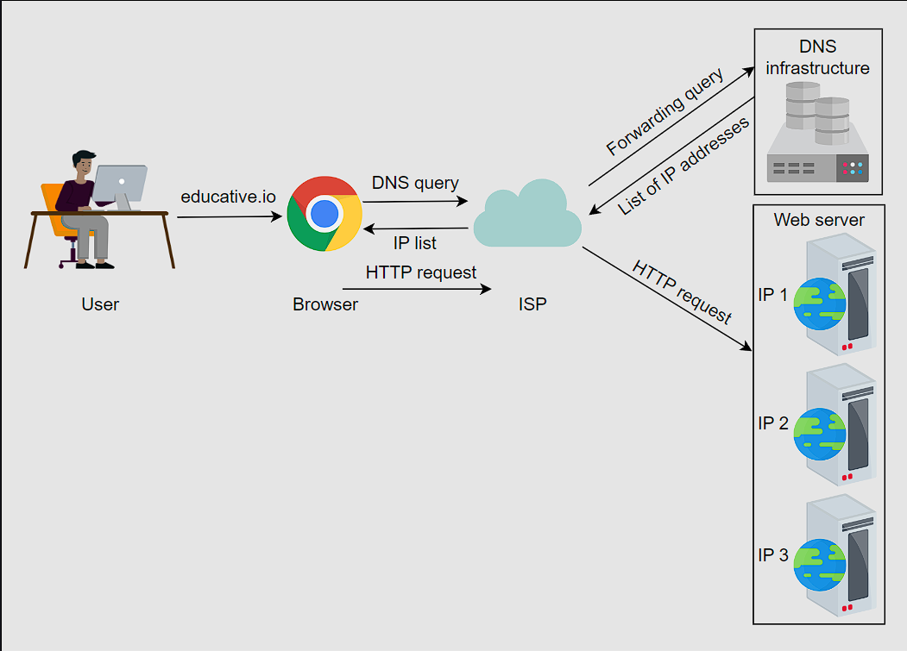
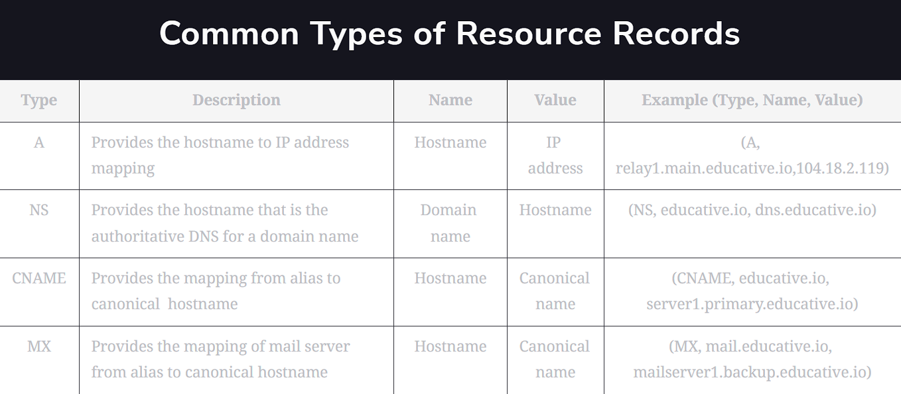
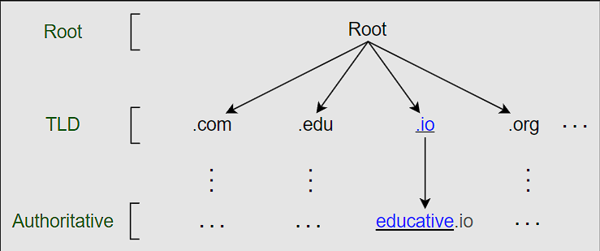
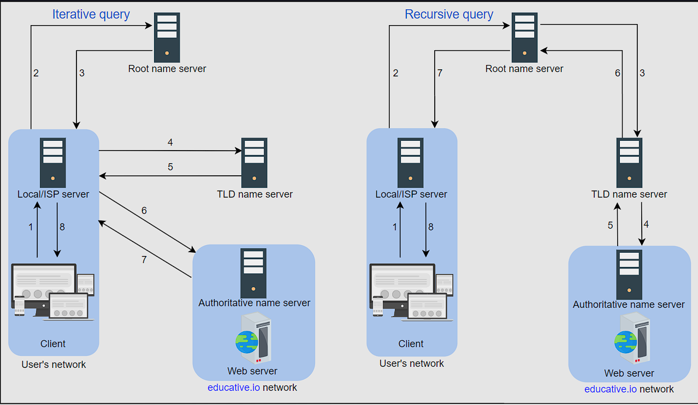
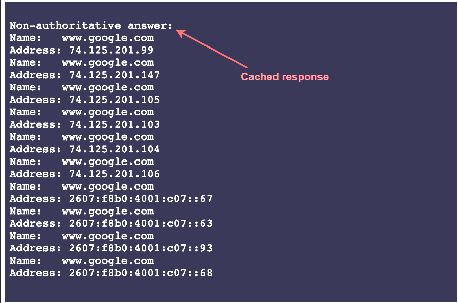

# DNS
The domain name system (DNS) is the Internet’s naming service that maps human-friendly domain names to machine-readable IP addresses. The service of DNS is transparent to users. When a user enters a domain name in the browser, the browser has to translate the domain name to IP address by asking the DNS infrastructure. Once the desired IP address is obtained, the user’s request is forwarded to the destination web server.

The slides below show the high-level flow of the working of DNS:

- Name servers: It’s important to understand that the DNS isn’t a single server. It’s a complete infrastructure with numerous servers. DNS servers that respond to users’ queries are called name servers.

- Resource records: The DNS database stores domain name to IP address mappings in the form of resource records (RR). The RR is the smallest unit of information that users request from the name servers. There are different types of RRs. The table below describes common RRs. The three important pieces of information are type, name, and value. The name and value change depending upon the type of the RR. 
  

- Caching: DNS uses caching at different layers to reduce request latency for the user. Caching plays an important role in reducing the burden on DNS infrastructure because it has to cater to the queries of the entire Internet.
- Hierarchy: DNS name servers are in a hierarchical form. The hierarchical structure allows DNS to be highly scalable because of its increasing size and query load.
  
## DNS hierarchy
As stated before, the DNS isn’t a single server that accepts requests and responds to user queries. It’s a complete infrastructure with name servers at different hierarchies.

1. DNS resolver: Resolvers initiate the querying sequence and forward requests to the other DNS name servers. Typically, DNS resolvers lie within the premise of the user’s network. However, DNS resolvers can also cater to users’ DNS queries through caching techniques, as we will see shortly. These servers can also be called local or default servers.
2. Root-level name servers: These servers receive requests from local servers. Root name servers maintain name servers based on top-level domain names, such as .com, .edu, .us, and so on. For instance, when a user requests the IP address of educative.io, root-level name servers will return a list of top-level domain (TLD) servers that hold the IP addresses of the .io domain.
3. Top-level domain (TLD) name servers: These servers hold the IP addresses of authoritative name servers. The querying party will get a list of IP addresses that belong to the authoritative servers of the organization.
4. Authoritative name servers: These are the organization’s DNS name servers that provide the IP addresses of the web or application servers.

## DNS resolver
DNS resolvers are the first point of contact for users’ DNS queries. Resolvers are typically located within the user’s network. However, they can also be located outside the user’s network. For instance, a user can configure a public DNS resolver, such as Google’s public DNS resolver, to resolve DNS queries. The resolver is responsible for initiating the querying sequence and forwarding the request to the other DNS name servers. The resolver can also cache the responses to reduce the latency of the subsequent requests. The resolver can also be called a local or default server.(13个顶级根域名服务器有大量的复制)

## Iterative versus recursive query resolution
1. Iterative: The local server requests the root, TLD, and the authoritative servers for the IP address.
2. Recursive: The end user requests the local server. The local server further requests the root DNS name servers. The root name servers forward the requests to other name servers.

## DNS caching
Caching refers to the temporary storage of frequently requested resource records. A record is a data unit within the DNS database that shows a name-to-value binding. Caching reduces response time to the user and decreases network traffic. When we use caching at different hierarchies, it can reduce a lot of querying burden on the DNS infrastructure. Caching can be implemented in the browser, operating systems, local name server within the user’s network, or the ISP’s DNS resolvers.

## DNS as a distributed system
Although the DNS hierarchy facilitates the distributed Internet that we know today, it’s a distributed system itself. The distributed nature of DNS has the following advantages:

It avoids becoming a single point of failure (SPOF).
It achieves low query latency so users can get responses from nearby servers.
It gets a higher degree of flexibility during maintenance and updates or upgrades. For example, if one DNS server is down or overburdened, another DNS server can respond to user queries.
There are 13 logical root name servers (named letter A through M) with many instances spread throughout the globe. These servers are managed by 12 different organizations.

Let’s now go over how DNS is scalable, reliable, and consistent.

## Highly scalable
Due to its hierarchical nature, DNS is a highly scalable system. Roughly 1,000 replicated instances of 13 root-level servers are spread throughout the world strategically to handle user queries. The working labor is divided among TLD and root servers to handle a query and, finally, the authoritative servers that are managed by the organizations themselves to make the entire system work. As shown in the DNS hierarchy tree above, different services handle different portions of the tree enabling scalability and manageability of the system.

## Highly reliable
- Caching: The caching is done in the browser, the operating system, and the local name server, and the ISP DNS resolvers also maintain a rich cache of frequently visited services. Even if some DNS servers are temporarily down, cached records can be served to make DNS a reliable system.
- Server replication: DNS has replicated copies of each logical server spread systematically across the globe to entertain user requests at low latency. The redundant servers improve the reliability of the overall system.
- Protocol: Although many clients use DNS over unreliable user datagram protocol (UDP), UDP has its advantages. UDP is much faster and, therefore, improves DNS performance. Furthermore, Internet service’s reliability has improved since its inception, so UDP is usually favored over TCP. A DNS resolver can resend the UDP request if it didn’t get a reply to a previous one. This request-response needs just one round trip, which provides a shorter delay as compared to TCP, which needs a three-way handshake before data exchange.
  
## Highly consistent
DNS uses various protocols to update and transfer information among replicated servers in a hierarchy. DNS compromises on strong consistency to achieve high performance because data is read frequently from DNS databases as compared to writing. However, DNS provides eventual consistency and updates records on replicated servers lazily. Typically, it can take from a few seconds up to three days to update records on the DNS servers across the Internet. The time it takes to propagate information among different DNS clusters depends on the DNS infrastructure, the size of the update, and which part of the DNS tree is being updated.

Consistency can suffer because of caching too. Since authoritative servers are located within the organization, it may be possible that certain resource records are updated on the authoritative servers in case of server failures at the organization. Therefore, cached records at the default/local and ISP servers may be outdated. To mitigate this issue, each cached record comes with an expiration time called time-to-live (TTL).

## nslookup output

- The Non-authoritative answer, as the name suggests, is the answer provided by a server that is not the authoritative server of Google. It isn’t in the list of authoritative nameservers that Google maintains. So, where does the answer come from? The answer is provided by second, third, and fourth-hand name servers configured to reply to our DNS query—for example, our university or office DNS resolver, our ISP nameserver, our ISP’s ISP nameserver, and so on. In short, it can be considered as a cached version of Google’s authoritative nameservers response. If we try multiple domain names, we’ll realize that we receive a cached response most of the time.

- If we run the same command multiple times, we’ll receive the same IP addresses list but in a different order each time. The reason for that is DNS is indirectly performing load balancing. It’s an important term that we’ll gain familiarity with in the coming lessons.

## dig output
- The Query time: 4 msec represents the time it takes to get a response from the DNS server. For various reasons, these numbers may be different in our case.
- The 300 value in the ANSWER SECTION represents the number of seconds the cache is maintained in the DNS resolver. This means that Google’s ADNS keeps a TTL value of five minutes

## QA
If we need DNS to tell us which IP to reach a website or service, how will we know the DNS resolver’s IP address? (It seems like a chicken-and-egg problem!)

ANSWER: The DNS resolver’s IP address is configured in the operating system or the browser(/etc/resolv.conf in Linux). The operating system or the browser sends the DNS query to the DNS resolver. The DNS resolver then forwards the query to the DNS name servers. (Often, DHCP provides the default DNS resolver IP address along with other configurations.)DNS resolvers have special software installed to resolve queries through the DNS infrastructure. The root server’s IP addresses are within the special software. Typically, the Berkeley Internet Name Domain (BIND) software is used on DNS resolvers. The InterNIC maintains the updated list of 13 root servers.
