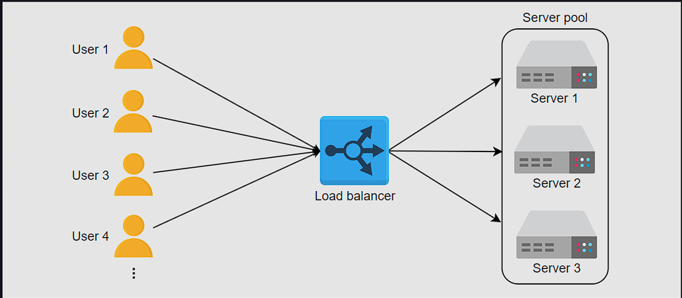
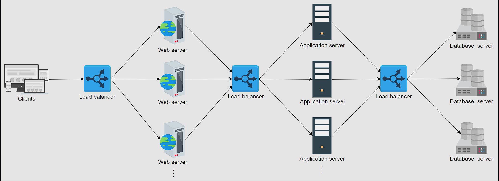
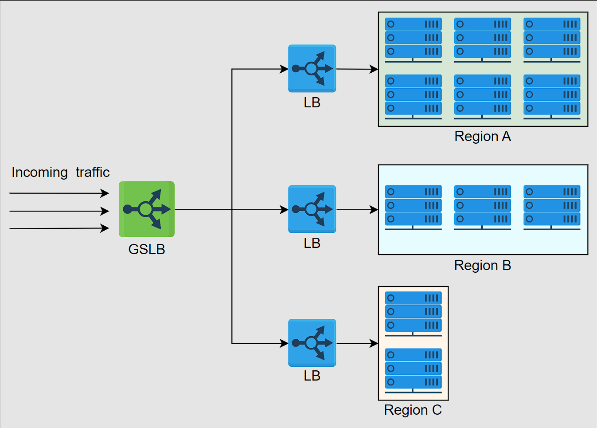
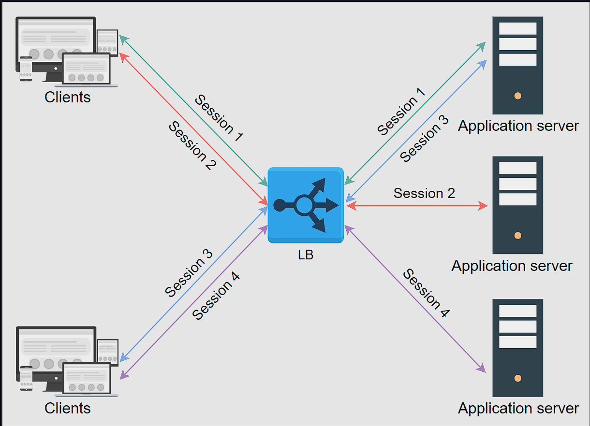
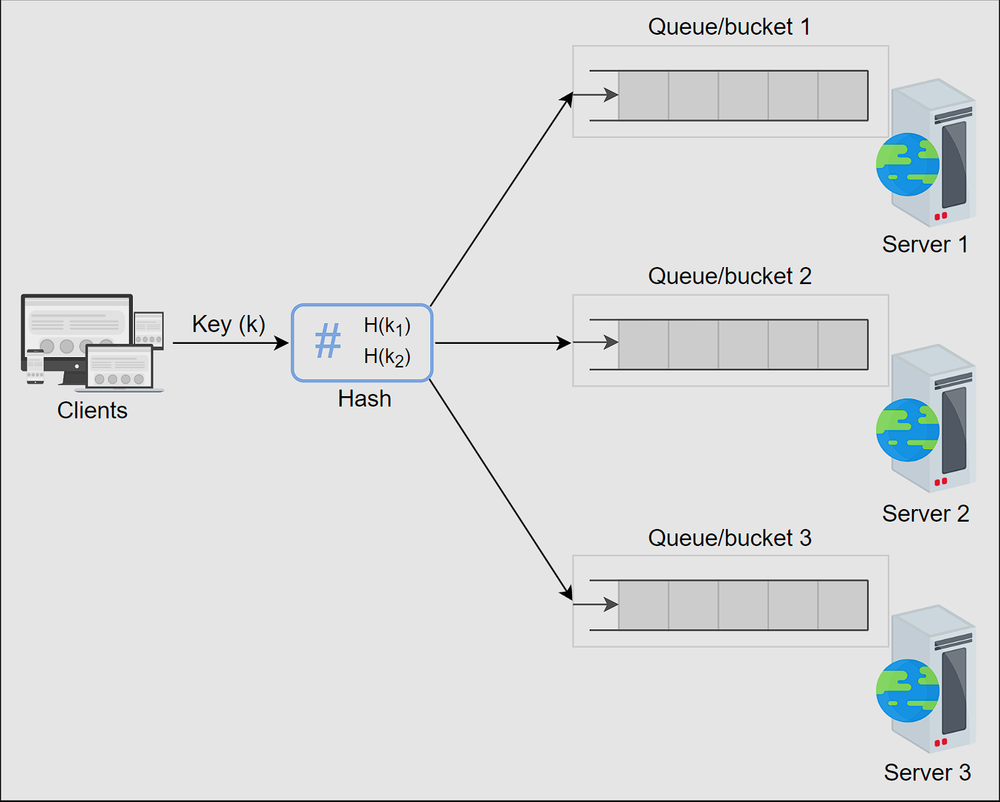
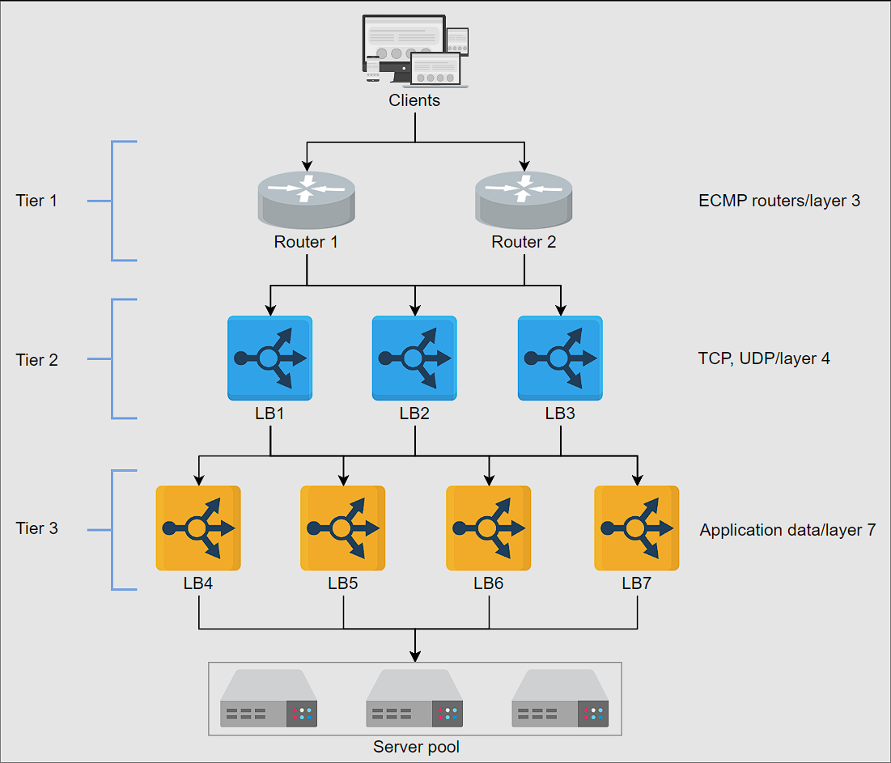
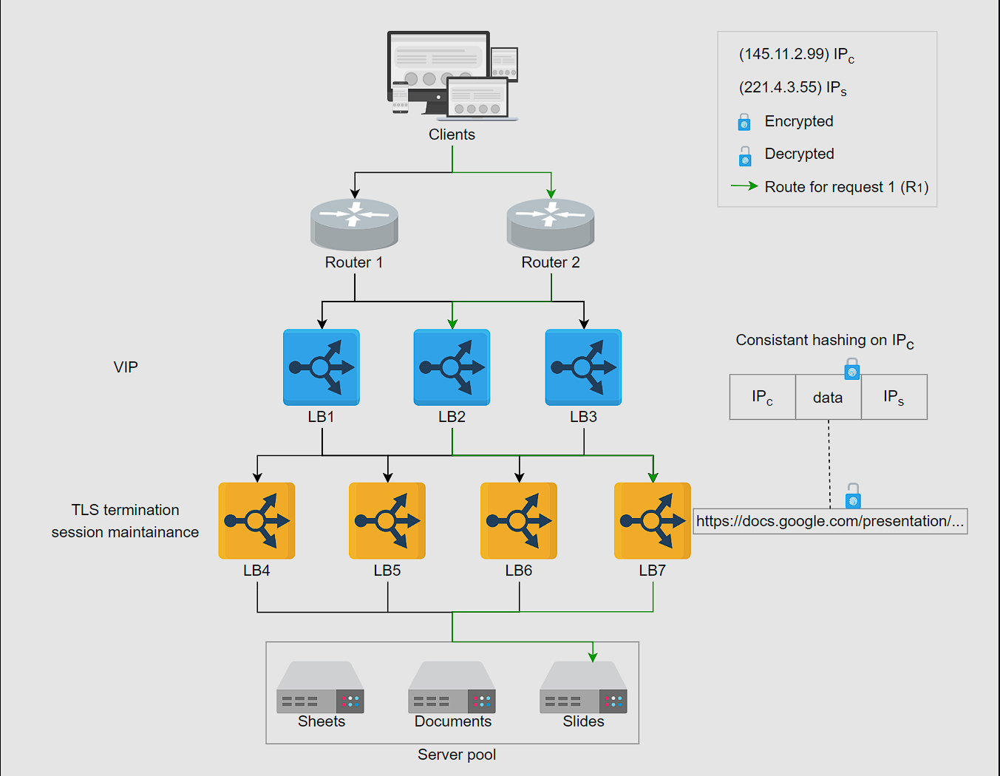
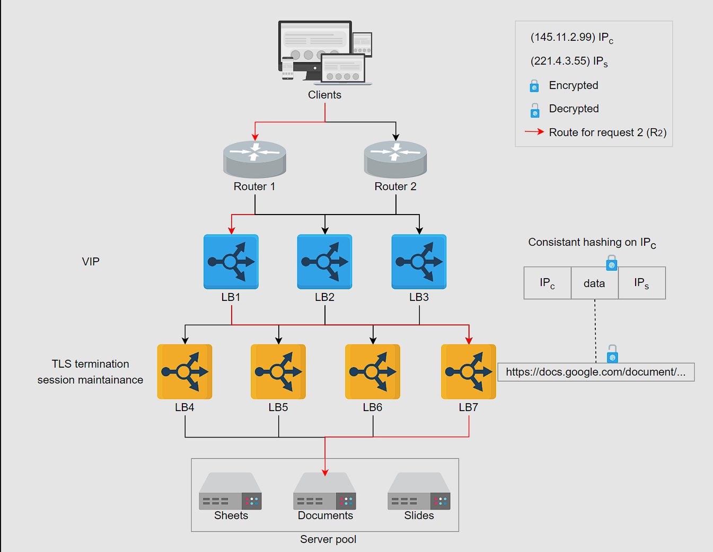
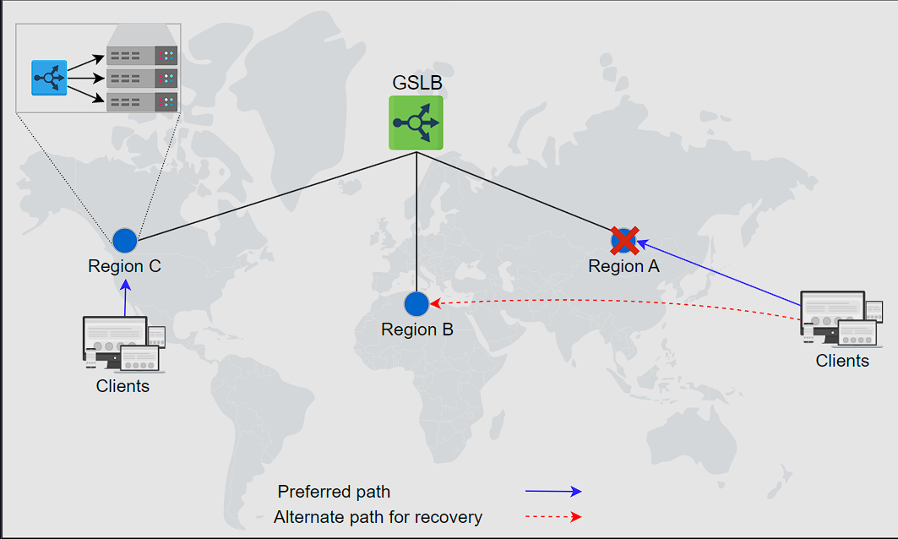

# Load Balancers
Millions of requests could arrive per second in a typical data center. To serve these requests, thousands (or a hundred thousand) servers work together to share the load of incoming requests. 

A load balancer (LB) is the answer to the question. The job of the load balancer is to fairly divide all clients’ requests among the pool of available servers. Load balancers perform this job to avoid overloading or crashing servers.

The load balancing layer is the first point of contact within a data center after the firewall. A load balancer may not be required if a service entertains a few hundred or even a few thousand requests per second. However, for increasing client requests, load balancers provide the following capabilities:

- Scalability: By adding servers, the capacity of the application/service can be increased seamlessly. Load balancers make such upscaling or downscaling transparent to the end users.
- Availability: Even if some servers go down or suffer a fault, the system still remains available. One of the jobs of the load balancers is to hide faults and failures of servers.
- Performance: Load balancers can forward requests to servers with a lesser load so the user can get a quicker response time. This not only improves performance but also improves resource utilization.
Here’s an abstract depiction of how load balancers work:


## Placement of Load Balancers
Generally, LBs sit between clients and servers. Requests go through to servers and back to clients via the load balancing layer. However, that isn’t the only point where load balancers are used.

Let’s consider the three well-known groups of servers. That is the web, the application, and the database servers. To divide the traffic load among the available servers, load balancers can be used between the server instances of these three services in the following way:

- Place LBs between end users of the application and web servers/application gateway.
- Place LBs between the web servers and application servers that run the business/application logic.
- Place LBs between the application servers and database servers.
  

In reality, load balancers can be potentially used between any two services with multiple instances within the design of a system.

## Services offered by load balancers
LBs not only enable services to be scalable, available, and highly performant, they offer some key services like the following:

1. Health checking: LBs use the heartbeat protocol to monitor the health and, therefore, reliability of end-servers. Another advantage of health checking is the improved user experience.
2. TLS termination: LBs reduce the burden on end-servers by handling TLS termination with the client. TLS termination is the process of decrypting the encrypted traffic from the client and forwarding it to the server in plain text.
3. Predictive analytics: LBs can predict traffic patterns through analytics performed over traffic passing through them or using statistics of traffic obtained over time.
4. Reduced human intervention: Because of LB automation, reduced system administration efforts are required in handling failures.
5. Service discovery: An advantage of LBs is that the clients’ requests are forwarded to appropriate hosting servers by inquiring about the service registry.
6. Security: LBs may also improve security by mitigating attacks like denial-of-service (DoS) at different layers of the OSI model (layers 3, 4, and 7).
   
As a whole, load balancers provide flexibility, reliability, redundancy, and efficiency to the overall design of the system.

## Global and local load balancers
From the previous lesson, it may seem like load balancing is performed only within the data center. However, load balancing is required at a global and a local scale. Let’s understand the function of each of the two:

- Global server load balancing (GSLB): GSLB involves the distribution of traffic load across multiple geographical regions.
- Local load balancing: This refers to load balancing achieved within a data center. This type of load balancing focuses on improving efficiency and better resource utilization of the hosting servers in a data center.

### Global server load balancing
GSLB ensures that globally arriving traffic load is intelligently forwarded to a data center. For example, power or network failure in a data center requires that all the traffic be rerouted to another data center. GSLB takes forwarding decisions based on the users’ geographic locations, the number of hosting servers in different locations, the health of data centers, and so on.

In the next lesson, we’ll also learn how GSLB offers automatic zonal failover. GSLB service can be installed on-premises or obtained through Load Balancing as a Service (LBaaS).

The illustration below shows that the GSLB can forward requests to three different data centers. Each local load balancing layer within a data center will maintain a control plane connection with the GSLB providing information about the health of the LBs and the server farm. GSLB uses this information to drive traffic decisions and forward traffic load based on each region’s configuration and monitoring information.


## Load balancing in DNS
We understand that DNS can respond with multiple IP addresses for a DNS query. In the lesson on DNS, we discussed that it’s possible to do load balancing through DNS while looking at the output of nslookup. DNS uses a simple technique of reordering the list of IP addresses in response to each DNS query. Therefore, different users get a reordered IP address list. It results in users visiting a different server to entertain their requests. In this way, DNS distributes the load of requests on different data centers. This is performing GSLB. In particular, DNS uses round-robin to perform load balancing.

Round-robin in DNS forwards clients to data centers in a strict circular order. However, round-robin has the following limitations:

- Different ISPs have a different number of users. An ISP serving many customers will provide the same cached IP to its clients, resulting in uneven load distribution on end-servers.
- Because the round-robin load-balancing algorithm doesn’t consider any end-server crashes, it keeps on distributing the IP address of the crashed servers until the TTL of the cached entries expires. Availability of the service, in that case, can take a hit due to DNS-level load balancing.
  
Despite its limitations, round-robin is still widely used by many DNS service providers. Furthermore, DNS uses short TTL for cached entries to do effective load balancing among different data centers.

Note: DNS isn’t the only form of GSLB. Application delivery controllers (ADCs) and cloud-based load balancing (discussed later) are better ways to do GSLB.Application delivery controllers (ADCs) are part of the application delivery network (ADN). They can be considered the superset of LBs offering various services, including load balancing. The primary task of ADCs is to perform web acceleration to reduce the load from the server farm. Some well-known services between layers 3 and 7 include caching, SSL offloading, proxy/reverse proxy services, IP traffic optimization, and many more. ADCs also implement GSLB.

## Local load balancing
DNS plays a vital role in balancing the load, but it suffers from the following limitations:

The small size of the DNS packet (512 Bytes) isn’t enough to include all possible IP addresses of the servers.
There’s limited control over the client’s behavior. Clients may select arbitrarily from the received set of IP addresses. Some of the received IP addresses may belong to busy data centers.
Clients can’t determine the closest address to establish a connection with. Although DNS geolocation and anycasting-like solutions can be implemented, they aren’t trivial solutions.
In case of failures, recovery can be slow through DNS because of the caching mechanism, especially when TTL values are longer.
To solve some of the above problems, we need another layer of load balancing in the form of local LB. In the next lesson, we’ll discuss different details about local load balancers.

Local load balancers reside within a data center. They behave like a reverse proxy and make their best effort to divide incoming requests among the pool of available servers. Incoming clients’ requests seamlessly connect to the LB that uses a virtual IP address 

### load balancing algorithms
- Round-robin scheduling: In this algorithm, each request is forwarded to a server in the pool in a repeating sequential manner.
- Weighted round-robin: If some servers have a higher capability of serving clients’ requests, then it’s preferred to use a weighted round-robin algorithm. In a weighted round-robin algorithm, each node is assigned a weight. LBs forward clients’ requests according to the weight of the node. The higher the weight, the higher the number of assignments.
- Least connections: In certain cases, even if all the servers have the same capacity to serve clients, uneven load on certain servers is still a possibility. For example, some clients may have a request that requires longer to serve. Or some clients may have subsequent requests on the same connection. In that case, we can use algorithms like least connections where newer arriving requests are assigned to servers with fewer existing connections. LBs keep a state of the number and mapping of existing connections in such a scenario. We’ll discuss more about state maintenance later in the lesson.
- Least response time: In performance-sensitive services, algorithms such as least response time are required. This algorithm ensures that the server with the least response time is requested to serve the clients.
- IP hash: Some applications provide a different level of service to users based on their IP addresses. In that case, hashing the IP address is performed to assign users’ requests to servers.
- URL hash: It may be possible that some services within the application are provided by specific servers only. In that case, a client requesting service from a URL is assigned to a certain cluster or set of servers. The URL hashing algorithm is used in those scenarios.
  
There are other algorithms also, like randomized or weighted least connections algorithms.

## Static versus dynamic algorithms
Algorithms can be static or dynamic depending on the machine’s state. Let’s look at each of the categories individually:

Static algorithms don’t consider the changing state of the servers. Therefore, task assignment is carried out based on existing knowledge about the server’s configuration. Naturally, these algorithms aren’t complex, and they get implemented in a single router or commodity machine where all the requests arrive.

Dynamic algorithms are algorithms that consider the current or recent state of the servers. Dynamic algorithms maintain state by communicating with the server, which adds a communication overhead. State maintenance makes the design of the algorithm much more complicated.

Dynamic algorithms require different load balancing servers to communicate with each other to exchange information. Therefore, dynamic algorithms can be modular because no single entity will do the decision-making. Although this adds complexity to dynamic algorithms, it results in improved forwarding decisions. Finally, dynamic algorithms monitor the health of the servers and forward requests to active servers only.

Note: In practice, dynamic algorithms provide far better results because they maintain a state of serving hosts and are, therefore, worth the effort and complexity.

## Stateful versus stateless LBs
While static and dynamic algorithms are required to consider the health of the hosting servers, a state is maintained to hold session information of different clients with hosting servers.

If the session information isn’t kept at a lower layer (distributed cache or database), load balancers are used to keep the session information. Below, we describe two ways of handling session maintenance through LBs:
- stateful
- stateless

### Stateful LBs
As the name indicates, stateful load balancing involves maintaining a state of the sessions established between clients and hosting servers. The stateful LB incorporates state information in its algorithm to perform load balancing.

Essentially, the stateful LBs retain a data structure that maps incoming clients to hosting servers. Stateful LBs increase complexity and limit scalability because session information of all the clients is maintained across all the load balancers. That is, load balancers share their state information with each other to make forwarding decisions.


### Stateless LBs
Stateless load balancing maintains no state and is, therefore, faster and lightweight. Stateless LBs use consistent hashing to make forwarding decisions. However, if infrastructure changes (for example, a new application server joining), stateless LBs may not be as resilient as stateful LBs because consistent hashing alone isn’t enough to route a request to the correct application server. Therefore, a local state may still be required along with consistent hashing.


## Type of load balancers
Depending on the requirements, load balancing can be performed at the network/transport and application layer of the open systems interconnection (OSI) layers.

- Layer 4 load balancers: Layer 4 refers to the load balancing performed on the basis of transport protocols like TCP and UDP. These types of LBs maintain connection/session with the clients and ensure that the same (TCP/UDP) communication ends up being forwarded to the same back-end server. Even though TLS termination is performed at layer 7 LBs, some layer 4 LBs also support it.
- Layer 7 load balancers: Layer 7 load balancers are based on the data of application layer protocols. It’s possible to make application-aware forwarding decisions based on HTTP headers, URLs, cookies, and other application-specific data—for example, user ID. Apart from performing TLS termination, these LBs can take responsibilities like rate limiting users, HTTP routing, and header rewriting.
  
Note: Layer 7 load balancers are smart in terms of inspection. However layer 4 load balancers are faster in terms of processing.

## Load balancer deployment
We discussed the trade-offs of load balancing performed at different OSI layers. In practice, however, a single layer LB isn’t enough for a large data center. In fact, multiple layers of load balancers coordinate to take informed forwarding decisions. A traditional data center may have a three-tier LB as shown below:


- Tier-0 and tier-1 LBs
If DNS can be considered as the tier-0 load balancer, equal cost multipath (ECMP) routers are the tier-1 LBs. From the name of ECMP, it’s evident that this layer divides incoming traffic on the basis of IP or some other algorithm like round-robin or weighted round-robin. Tier-1 LBs will balance the load across different paths to higher tiers of load balancers.ECMP routers play a vital role in the horizontal scalability of the higher-tier LBs.

- Tier-2 LBs
The second tier of LBs include layer 4 load balancers. Tier-2 LBs make sure that for any connection, all incoming packets are forwarded to the same tier-3 LBs. To achieve this goal, a technique like consistent hashing can be utilized. But in case of any changes to the infrastructure, consistent hashing may not be enough. Therefore, we have to maintain a local or global state as we’ll see in the coming sections of the lesson.Tier-2 load balancers can be considered the glue between tier-1 and tier-3 LBs. Excluding tier-2 LBs could result in erroneous forwarding decisions in case of failures or dynamic scaling of LBs.

- Tier-3 LBs
Layer 7 LBs provide services at tier 3. Since these LBs are in direct contact with the back-end servers, they perform health monitoring of servers at HTTP level. This tier enables scalability by evenly distributing requests among the set of healthy back-end servers and provides high availability by monitoring the health of servers directly. This tier also reduces the burden on end-servers by handling low-level details like TCP-congestion control protocols, the discovery of Path MTU (maximum transmission unit), the difference in application protocol between client and back-end servers, and so on. The idea is to leave the computation and data serving to the application servers and effectively utilize load balancing commodity machines for trivial tasks. In some cases, layer 7 LBs are at the same level as the service hosts.

To summarize, tier 1 balances the load among the load balancers themselves. Tier 2 enables a smooth transition from tier 1 to tier 3 in case of failures, whereas tier 3 does the actual load balancing between back-end servers. Each tier performs other tasks to reduce the burden on end-servers.

## Practical example
Let’s look at an example where requests from a client come in and get forwarded to different application servers based on the application data inside the client’s network packets.


1. R1 indicates request 1 coming through one of the ECMP routers (tier-1 LBs).
2. ECMP routers forward R1 to any of the three available tier-2 LBs using a round-robin algorithm. Tier-2 LBs take a hash of the source IP address of R1 and forward it to the same tier-3 LB. In this case, R1 is forwarded to tier-3 LB-2.
3. Tier-3, upon receiving the packet, offloads TLS and reads the HTTP(S) data. By observing the requested URL, it forwards the request to the server handling requests for slides.


R2 takes the same path but a different end-server because the requested URL contains document instead of slides. Tier-3 LBs are preconfigured to forward requests to application servers based on the application data. For instance, a typical HAProxy server can have the following configuration in tier-3 LBs:

```bash
mode HTTP                               //define which mode the LB will work on, TCP for tier-2 LBs
acl slidesApp path_end -i /presentation //define a category of applications if the path ends in /presentation
use_backend slidesServers if slidesApp  // use a set of backend servers if the request arrives for slidesApp
backend slidesServers                   // listing servers serving slidesApp
server slides1 192.168.12.1:80          //using slides1 server to serve slidesApp. 
```

## implementation of load balancer
Different kinds of load balancers can be implemented depending on the number of incoming requests, organization, and application-specific requirements:

- Hardware load balancers: Hardware load balancers are physical devices that are placed in front of the servers. These devices are expensive and are usually used in large data centers. Hardware load balancers are fast and can handle a large number of requests. However, they are not flexible and require manual configuration.
- Software load balancers: are becoming increasingly popular because of their flexibility, programmability, and cost-effectiveness. That’s all possible because they’re implemented on commodity hardware. Software LBs scale well as requirements grow. Availability won’t be an issue with software LBs because small additional costs are required to implement shadow load balancers on commodity hardware. Additionally, software LBs can provide predictive analysis that can help prepare for future traffic patterns.
- Cloud load balancers: With the advent of the field of cloud computing, Load Balancers as a Service (LBaaS) has been introduced. This is where cloud owners provide load balancing services. Users pay according to their usage or the service-level agreement (SLA) with the cloud provider. Cloud-based LBs may not necessarily replace a local on-premise load balancing facility, but they can perform global traffic management between different zones. Primary advantages of such load balancers include ease of use, management, metered cost, flexibility in terms of usage, auditing, and monitoring services to improve business decisions. An example of how cloud-based LBs can provide GSLB is given below:

Another interesting implementation of load balancers comes in the form of client-side load balancing. Client-side load balancing is suited where there are numerous services, each with many instances (such as load balancing in Twitter). Our focus, however, is on traditional load balancers because most three-tier applications employ these in their design.

LBs have come a long way to become a service offered in the cloud, starting since their inception in the form of hardware. They’re a key component of any enterprise-level service. Horizontal scalability of hosting servers will always require a good load balancing layer capable of providing load balancing, session maintenance, TLS offloading, service discovery, and more.