# Database
Let’s start with a simple question. Can we make a software application without using databases? Let’s suppose we have an application like WhatsApp. People use our application to communicate with their friends. Now, where and how we can store information (a list of people’s names and their respective messages) permanently and retrieve it?

We can use a simple file to store all the records on separate lines and retrieve them from the same file. But using a file for storage has some limitations.

- We can’t offer concurrent management to separate users accessing the storage files from different locations.
- We can’t grant different access rights to different users.
- How will the system scale and be available when adding thousands of entries?
- How will we search content for different users in a short time?

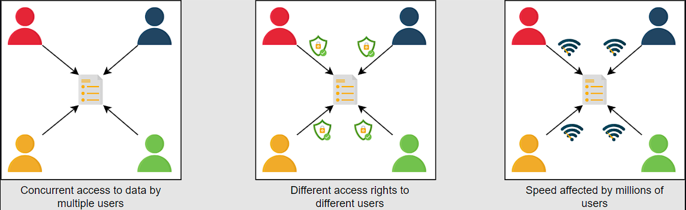

The above limitations can be addressed using databases.

A database is an organized collection of data that can be managed and accessed easily. Databases are created to make it easier to store, retrieve, modify, and delete data in connection with different data-processing procedures.Some of the applications where we use database management are the banking systems, online shopping stores, and so on. Different organizations have different sizes of databases according to their needs.

## Types of Databases
There are two basic types of databases:
- SQL (relational databases)
- NoSQL (non-relational databases)
They differ in terms of their intended use case, the type of information they hold, and the storage method they employ.

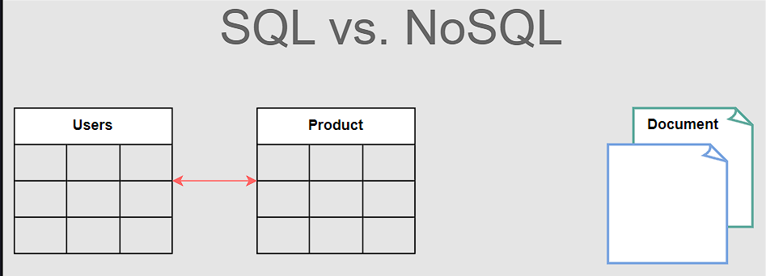

Relational databases, like phone books that record contact numbers and addresses, are organized and have predetermined schemas. Non-relational databases, like file directories that store anything from a person’s constant information to shopping preferences, are unstructured, scattered, and feature a dynamic schema. We’ll discuss their differences and their types in detail in the next lesson.

## Relational Databases
Relational databases adhere to particular schemas before storing the data. The data stored in relational databases has prior structure. Mostly, this model organizes data into one or more relations (also called tables), with a unique key for each tuple (instance). Each entity of the data consists of instances and attributes, where instances are stored in rows, and the attributes of each instance are stored in columns. Since each tuple has a unique key, a tuple in one table can be linked to a tuple in other tables by storing the primary keys in other tables, generally known as foreign keys.

A Structure Query Language (SQL) is used for manipulating the database. This includes insertion, deletion, and retrieval of data.

There are various reasons for the popularity and dominance of relational databases, which include simplicity, robustness, flexibility, performance, scalability, and compatibility in managing generic data.

Relational databases provide the atomicity, consistency, isolation, and durability (ACID) properties to maintain the integrity of the database. ACID is a powerful abstraction that simplifies complex interactions with the data and hides many anomalies (like dirty reads, dirty writes, read skew, lost updates, write skew, and phantom reads) behind a simple transaction abort.

But ACID is like a big hammer by design so that it’s generic enough for all the problems. If some specific application only needs to deal with a few anomalies, there’s a window of opportunity to use a custom solution for higher performance, though there is added complexity.

Let’s discuss ACID in detail:

- Atomicity: A transaction is considered an atomic unit. Therefore, either all the statements within a transaction will successfully execute, or none of them will execute. If a statement fails within a transaction, it should be aborted and rolled back.

- Consistency: At any given time, the database should be in a consistent state, and it should remain in a consistent state after every transaction. For example, if multiple users want to view a record from the database, it should return a similar result each time.

- Isolation: In the case of multiple transactions running concurrently, they shouldn’t be affected by each other. The final state of the database should be the same as the transactions were executed sequentially.

- Durability: The system should guarantee that completed transactions will survive permanently in the database even in system failure events.

Example:
- MySQL
- Oracle Database
- Microsoft SQL Server
- IBM 
- DB2
- Postgres
- SQLite
  
### Advantages of Relational Databases
Relational databases are the default choices of software professionals for structured data storage. There are a number of advantages to these databases. One of the greatest powers of the relational database is its abstractions of ACID transactions and related programming semantics. This make it very convenient for the end-programmer to use a relational database. Let’s revisit some important features of relational databases:

- Flexibility
In the context of SQL, data definition language (DDL) provides us the flexibility to modify the database, including tables, columns, renaming the tables, and other changes. DDL even allows us to modify schema while other queries are happening and the database server is running.

- Reduced redundancy
One of the biggest advantages of the relational database is that it eliminates data redundancy. The information related to a specific entity appears in one table while the relevant data to that specific entity appears in the other tables linked through foreign keys. This process is called normalization and has the additional benefit of removing an inconsistent dependency.

- Concurrency
Concurrency is an important factor while designing an enterprise database. In such a case, the data is read and written by many users at the same time. We need to coordinate such interactions to avoid inconsistency in data—for example, the double booking of hotel rooms. Concurrency in a relational database is handled through transactional access to the data. As explained earlier, a transaction is considered an atomic operation, so it also works in error handling to either roll back or commit a transaction on successful execution.

- Integration
The process of aggregating data from multiple sources is a common practice in enterprise applications. A common way to perform this aggregation is to integrate a shared database where multiple applications store their data. This way, all the applications can easily access each other’s data while the concurrency control measures handle the access of multiple applications.

- Backup and disaster recovery
Relational databases guarantee the state of data is consistent at any time. The export and import operations make backup and restoration easier. Most cloud-based relational databases perform continuous mirroring to avoid loss of data and make the restoration process easier and quicker.

### Disadvantages of Relational Databases1
Impedance mismatch is the difference between the relational model and the in-memory data structures. The relational model organizes data into a tabular structure with relations and tuples. SQL operation on this structured data yields relations aligned with relational algebra. However, it has some limitations. In particular, the values in a table take simple values that can’t be a structure or a list. The case is different for in-memory, where a complex data structure can be stored. To make the complex structures compatible with the relations, we would need a translation of the data in light of relational algebra. So, the impedance mismatch requires translation between two representations, as denoted in the following figure:

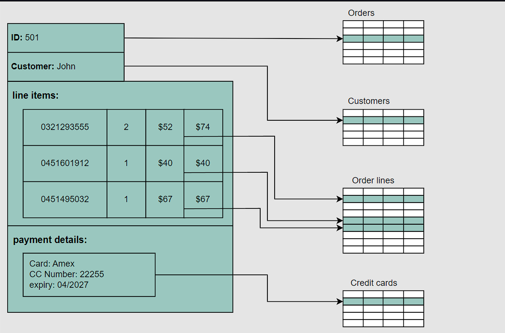

## Non-relational (NoSQL) databases?
A NoSQL database is designed for a variety of data models to access and manage data. There are various types of NoSQL databases, which we’ll explain in the next section. These databases are used in applications that require a large volume of semi-structured and unstructured data, low latency, and flexible data models. This can be achieved by relaxing some of the data consistency restrictions of other databases. Following are some characteristics of the NoSQL database:

- Simple design: Unlike relational databases, NoSQL doesn’t require dealing with the impedance mismatch—for example, storing all the employees’ data in one document instead of multiple tables that require join operations. This strategy makes it simple and easier to write less code, debug, and maintain.

- Horizontal scaling: Primarily, NoSQL is preferred due to its ability to run databases on a large cluster. This solves the problem when the number of concurrent users increases. NoSQL makes it easier to scale out since the data related to a specific employee is stored in one document instead of multiple tables over nodes. NoSQL databases often spread data across multiple nodes and balance data and queries across nodes automatically. In case of a node failure, it can be transparently replaced without any application disruption.

- Availability: To enhance the availability of data, node replacement can be performed without application downtime. Most of the non-relational databases’ variants support data replication to ensure high availability and disaster recovery.

- Support for unstructured and semi-structured data: Many NoSQL databases work with data that doesn’t have schema at the time of database configuration or data writes. For example, document databases are structureless; they allow documents (JSON, XML, BSON, and so on) to have different fields. For example, one JSON document can have fewer fields than the other.

- Cost: Licenses for many RDBMSs are pretty expensive, while many NoSQL databases are open source and freely available. Similarly, some RDBMSs rely on costly proprietary hardware and storage systems, while NoSQL databases usually use clusters of cheap commodity servers.

NoSQL databases are divided into various categories based on the nature of the operations and features, including document store, columnar database, key-value store, and graph database. We’ll discuss each of them along with their use cases from the system design perspective in the following sections.

## Type of NoSQL databases
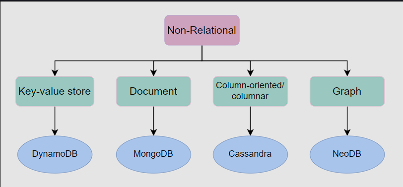

### Key-value store
Key-value databases use key-value methods like hash tables to store data in key-value pairs. We can see this depicted in the figure a couple of paragraphs below. Here, the key serves as a unique or primary key, and the values can be anything ranging from simple scalar values to complex objects. These databases allow easy partitioning and horizontal scaling of the data. Some popular key-value databases include Amazon DynamoDB, Redis, and Memcached DB.

Use case: Key-value databases are efficient for session-oriented applications. Session oriented-applications, such as web applications, store users’ data in the main memory or in a database during a session. This data may include user profile information, recommendations, targeted promotions, discounts, and more. A unique ID (a key) is assigned to each user’s session for easy access and storage. Therefore, a better choice to store such data is the key-value database.

The following figure shows an example of a key-value database. The Product ID and Type of the item are collectively considered as the primary key. This is considered as a key for this key-value database. Moreover, the schema for storing the item attributes is defined based on the nature of the item and the number of attributes it possesses.

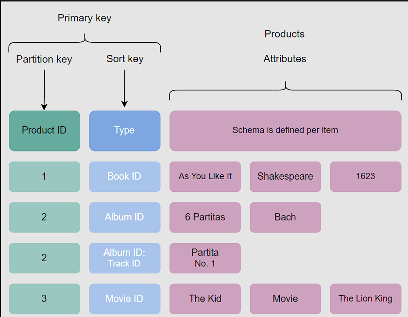

Note：像Redis这样的数据库，通过一个主键存储复杂化的结构，主要把数据存放在内存中，具有高速读写的特点，但是数据量不能太大，否则内存会爆掉。持久化上提供了两种手段，一种是RDB，一种是AOF。RDB是指定时间间隔通过snapshot数据备份，AOF是指每次写操作都记录一条日志，这样就可以保证数据不丢失。Redis的数据类型有String、Hash、List、Set、Sorted Set，这些数据类型都是支持原子操作的，所以Redis可以用来实现分布式锁。分布式锁的基本思想是通过互斥访问来实现资源的排他性。当一个节点需要访问共享资源时，它会尝试获取分布式锁，如果成功获取锁，则可以执行操作并访问资源；如果无法获取锁，则需要等待或执行其他处理。键值存储数据库通常基于分布式架构设计，可以将数据分散存储在多个节点上。通过将数据分片并在不同节点上进行分布，可以实现数据的负载均衡和并行处理，从而提高整体系统的吞吐量和性能。Redis 在一致性（Consistency）方面提供了不同的级别选择，可以根据应用需求进行配置。

在 Redis 中，一致性可以通过以下方式来实现：

单节点模式：在单节点模式下，Redis 提供了强一致性（Strong Consistency），即写入操作成功后，任何后续的读取操作都将立即返回最新的写入值。这种模式下，Redis 是单线程的，可以保证操作的顺序性和一致性。

主从复制：Redis 支持主从复制（Master-Slave Replication），可以将主节点的写操作复制到一个或多个从节点。从节点接收主节点的数据复制，并保持与主节点的数据一致性。在主从复制模式下，写操作在主节点完成后，异步地传播到从节点，因此在复制期间可能存在一定的延迟。读操作可以在主节点和从节点上进行，但在从节点上进行的读操作可能会存在一定的数据延迟，因为数据可能尚未完全同步。

Sentinel 哨兵模式：Sentinel 是 Redis 提供的用于高可用性的解决方案。在 Sentinel 哨兵模式下，多个 Redis 实例组成一个群集，其中一个实例为主节点，其他实例为从节点。Sentinel 负责监控 Redis 实例的健康状态，并在主节点故障时自动进行故障转移。在这种模式下，Redis 提供了较高的可用性，但在故障转移过程中可能存在一定的数据延迟。

需要注意的是，Redis 在默认配置下更注重性能和吞吐量，因此在分布式环境中，可能会牺牲一致性（Consistency）来获得更高的性能。但是，Redis 提供了一些配置选项，例如设置副本数量、使用同步复制等，以实现更强的一致性。具体的一致性级别取决于应用程序的需求和 Redis 的配置。

### Document store
A document database is designed to store and retrieve documents in formats like XML, JSON, BSON, and so on. These documents are composed of a hierarchical tree data structure that can include maps, collections, and scalar values. Documents in this type of database may have varying structures and data. MongoDB and Google Cloud Firestore are examples of document databases.

Use case: Document databases are suitable for unstructured catalog data, like JSON files or other complex structured hierarchical data. For example, in e-commerce applications, a product has thousands of attributes, which is unfeasible to store in a relational database due to its impact on the reading performance. Here comes the role of a document database, which can efficiently store each attribute in a single file for easy management and faster reading speed. Moreover, it’s also a good option for content management applications, such as blogs and video platforms. An entity required for the application is stored as a single document in such applications.

The following example shows data stored in a JSON document. This data is about a person. Various attributes are stored in the file, including id, name, email, and so on.

```json
{  "id": 1001,
   "name": "Brown",
   "title": "Mr.",
   "email": "brown@anyEmail.com",
   "cell": "123-465-9999",
   "likes": [
      "designing",
      "cycling",
      "skiing"],
   "businesses": [
      { "name": "ABC co.",
         "partner": "Vike",
         "status": "Bankrupt",
         "date_founded": {
            "$date": "2021-12-10" } }]}
```

### Graph database
Graph databases use the graph data structure to store data, where nodes represent entities, and edges show relationships between entities. The organization of nodes based on relationships leads to interesting patterns between the nodes. This database allows us to store the data once and then interpret it differently based on relationships. Popular graph databases include Neo4J, OrientDB, and InfiniteGraph. Graph data is kept in store files for persistent storage. Each of the files contains data for a specific part of the graph, such as nodes, links, properties, and so on.

In the following figure, some data is stored using a graph data structure in nodes connected to each other via edges representing relationships between nodes. Each node has some properties, like Name, ID, and Age. The node having ID: 2 has the Name of James and Age of 29 years.
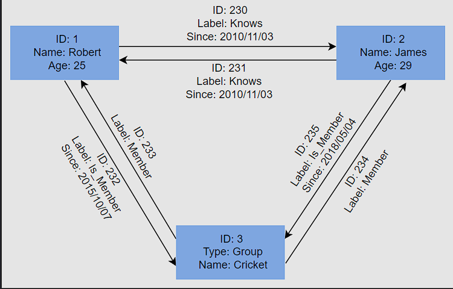

Use case: Graph databases can be used in social applications and provide interesting facts and figures among different kinds of users and their activities. The focus of graph databases is to store data and pave the way to drive analyses and decisions based on relationships between entities. The nature of graph databases makes them suitable for various applications, such as data regulation and privacy, machine learning research, financial services-based applications, and many more.

### Column store
Columnar databases store data in columns instead of rows. They enable access to all entries in the database column quickly and efficiently. Popular columnar databases include Cassandra, HBase, Hypertable, and Amazon SimpleDB.

Use case: Columnar databases are efficient for a large number of aggregation and data analytics queries. It drastically reduces the disk I/O requirements and the amount of data required to load from the disk. For example, in applications related to financial institutions, there’s a need to sum the financial transaction over a period of time. Columnar databases make this operation quicker by just reading the column for the amount of money, ignoring other attributes of customers.

The following figure shows an example of a columnar database, where data is stored in a column-oriented format. This is unlike relational databases, which store data in a row-oriented fashion:
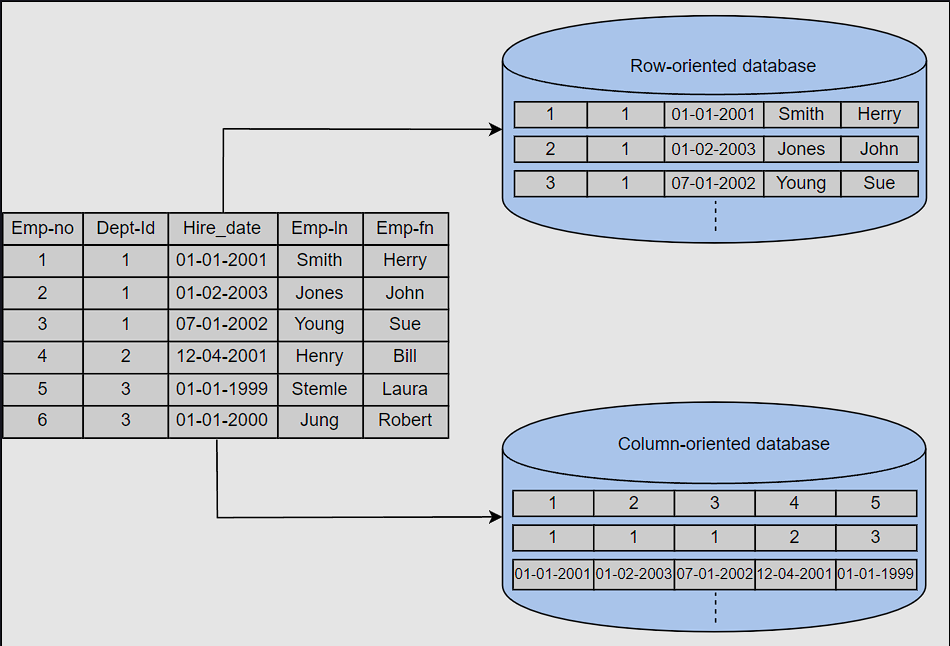

### Drawbacks of NoSQL databases
- Lack of standardization
NoSQL doesn’t follow any specific standard, like how relational databases follow relational algebra. Porting applications from one type of NoSQL database to another might be a challenge.

- Consistency
NoSQL databases provide different products based on the specific trade-offs between consistency and availability when failures can happen. We won’t have strong data integrity, like primary and referential integrities in a relational database. Data might not be strongly consistent but slowly converging using a weak model like eventual consistency.

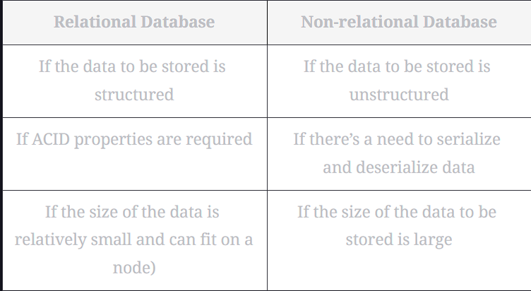

Note: When NoSQL databases first came into being, they were drastically different to program and use as compared to traditional databases. Though, due to extensive research in academia and industry over the last many years, the programmer-facing differences between NoSQL and traditional stores are blurring. We might be using the same SQL constructs to talk to a NoSQL store and get a similar level of performance and consistency as a traditional store. Google’s Cloud Spanner is one such database that’s geo-replicated with automatic horizontal sharding ability and high-speed global snapshots of data.

## Data Replication
Data is an asset for an organization because it drives the whole business. Data provides critical business insights into what’s important and what needs to be changed. Organizations also need to securely save and serve their clients’ data on demand. Timely access to the required data under varying conditions (increasing reads and writes, disks and node failures, network and power outages, and so on) is required to successfully run an online business.

We need the following characteristics from our data store:
- Availability under faults (failure of some disk, nodes, and network and power outages).
- Scalability (with increasing reads, writes, and other operations).
- Performance (low latency and high throughput for the clients).
  
It’s challenging, or even impossible, to achieve the above characteristics on a single node.

Replication refers to keeping multiple copies of the data at various nodes (preferably geographically distributed) to achieve availability, scalability, and performance. In this lesson, we assume that a single node is enough to hold our entire data. We won’t use this assumption while discussing the partitioning of data in multiple nodes. Often, the concepts of replication and partitioning go together.

However, with many benefits, like availability, replication comes with its complexities. Replication is relatively simple if the replicated data doesn’t require frequent changes. The main problem in replication arises when we have to maintain changes in the replicated data over time.

Additional complexities that could arise due to replication are as follows:

1. How do we keep multiple copies of data consistent with each other?
2. How do we deal with failed replica nodes?
3. Should we replicate synchronously or asynchronously?
4. How do we deal with replication lag in case of asynchronous replication?
5. How do we handle concurrent writes?
6. What consistency model needs to be exposed to the end programmers?

### Synchronous versus asynchronous replication
In synchronous replication, the primary node waits for acknowledgments from secondary nodes about updating the data. After receiving acknowledgment from all secondary nodes, the primary node reports success to the client. Whereas in asynchronous replication, the primary node doesn’t wait for the acknowledgment from the secondary nodes and reports success to the client after updating itself.

The advantage of synchronous replication is that all the secondary nodes are completely up to date with the primary node. However, there’s a disadvantage to this approach. If one of the secondary nodes doesn’t acknowledge due to failure or fault in the network, the primary node would be unable to acknowledge the client until it receives the successful acknowledgment from the crashed node. This causes high latency in the response from the primary node to the client.

On the other hand, the advantage of asynchronous replication is that the primary node can continue its work even if all the secondary nodes are down. However, if the primary node fails, the writes that weren’t copied to the secondary nodes will be lost.

The above paragraph explains a trade-off between data consistency and availability when different components of the system can fail.
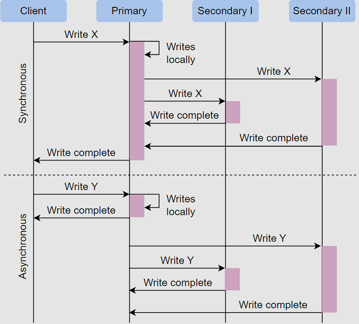

### Data replication models
- Single leader or primary-secondary replication
- Multi-leader replication
- Peer-to-peer or leaderless replication

#### Single leader or primary-secondary replication
In primary-secondary replication, data is replicated across multiple nodes. One node is designated as the primary. It’s responsible for processing any writes to data stored on the cluster. It also sends all the writes to the secondary nodes and keeps them in sync.

Primary-secondary replication is appropriate when our workload is read-heavy. To better scale with increasing readers, we can add more followers and distribute the read load across the available followers. However, replicating data to many followers can make a primary bottleneck. Additionally, primary-secondary replication is inappropriate if our workload is write-heavy.

Another advantage of primary-secondary replication is that it’s read resilient. Secondary nodes can still handle read requests in case of primary node failure. Therefore, it’s a helpful approach for read-intensive applications.

Replication via this approach comes with inconsistency if we use asynchronous replication. Clients reading from different replicas may see inconsistent data in the case of failure of the primary node that couldn’t propagate updated data to the secondary nodes. So, if the primary node fails, any missed updates not passed on to the secondary nodes can be lost.
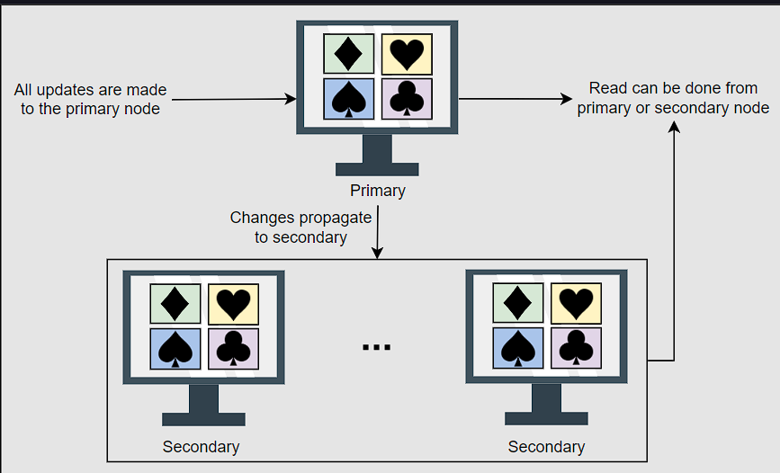
There are many different replication methods in primary-secondary replication:
- Statement-based replication
- Write-ahead log shipping
- Logical log replication
  
##### Statement-based replication
In the statement-based replication approach, the primary node saves all statements that it executes, like insert, delete, update, and so on, and sends them to the secondary nodes to perform. This type of replication was used in MySQL before version 5.1.

This type of approach seems good, but it has its disadvantages. For example, any nondeterministic function (such as NOW()) might result in distinct writes on the follower and leader. Furthermore, if a write statement is dependent on a prior write, and both of them reach the follower in the wrong order, the outcome on the follower node will be uncertain.

##### Write-ahead log shipping
In the write-ahead log shipping approach, the primary node sends the write-ahead log (WAL) to the secondary nodes. The WAL contains all the changes that are made to the database. The secondary nodes apply the changes in the same order as they were applied on the primary node. This approach is used in PostgreSQL and Oracle.The problem with WAL is that it only defines data at a very low level. It’s tightly coupled with the inner structure of the database engine, which makes upgrading software on the leader and followers complicated.

##### Logical log replication
In the logical log replication approach, the primary node sends the logical log to the secondary nodes. The logical log contains the data that’s changed in the database. The secondary nodes apply the changes in the same order as they were applied on the primary node. This approach is used in MySQL 5.1 and later versions.Row-based replication doesn’t have the same difficulties as WAL because it doesn’t require information about data layout inside the database engine.

#### Multi-leader replication
As discussed above, single leader replication using asynchronous replication has a drawback. There’s only one primary node, and all the writes have to go through it, which limits the performance. In case of failure of the primary node, the secondary nodes may not have the updated database.

Multi-leader replication is an alternative to single leader replication. There are multiple primary nodes that process the writes and send them to all other primary and secondary nodes to replicate. This type of replication is used in databases along with external tools like the Tungsten Replicator for MySQL.

This kind of replication is quite useful in applications in which we can continue work even if we’re offline—for example, a calendar application in which we can set our meetings even if we don’t have access to the internet. Once we’re online, it replicates its changes from our local database (our mobile phone or laptop acts as a primary node) to other nodes.
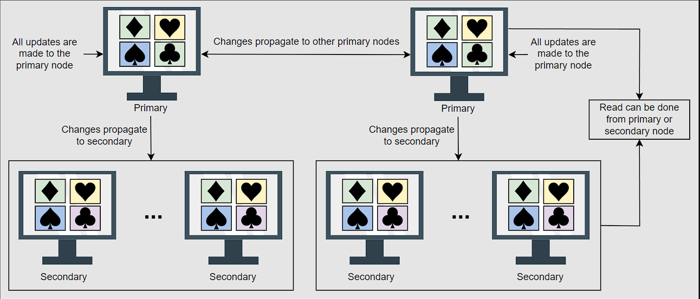

Multi-leader replication gives better performance and scalability than single leader replication, but it also has a significant disadvantage. Since all the primary nodes concurrently deal with the write requests, they may modify the same data, which can create a conflict between them. For example, suppose the same data is edited by two clients simultaneously. In that case, their writes will be successful in their associated primary nodes, but when they reach the other primary nodes asynchronously, it creates a conflict. Conflicts can result in different data at different nodes. These should be handled efficiently without losing any data. Let’s discuss some of the approaches to handle conflicts:
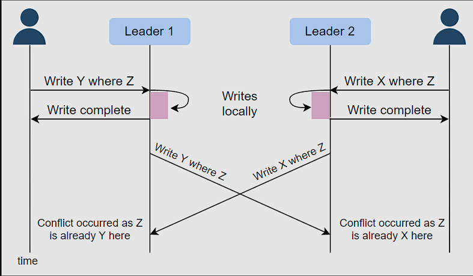

##### Conflict avoidance
1. Last write wins (LWW)
   Using their local clock, all nodes assign a timestamp to each update. When a conflict occurs, the update with the latest timestamp is selected.This approach can also create difficulty because the clock synchronization across nodes is challenging in distributed systems. There’s clock skew that can result in data loss.
2. Custom Logic
   In this approach, we can write our own logic to handle conflicts according to the needs of our application. This custom logic can be executed on both reads and writes. When the system detects a conflict, it calls our custom conflict handler.

There are many topologies through which multi-leader replication is implemented, such as circular topology, star topology, and all-to-all topology. The most common is the all-to-all topology. In star and circular topology, there’s again a similar drawback that if one of the nodes fails, it can affect the whole system. That’s why all-to-all is the most used topology.

#### Peer-to-peer or leaderless replication
In primary-secondary replication, the primary node is a bottleneck and a single point of failure. Moreover, it helps to achieve read scalability but fails in providing write scalability. The peer-to-peer replication model resolves these problems by not having a single primary node. All the nodes have equal weightage and can accept reads and writes requests. Amazon popularized such a scheme in their DynamoDB data store.
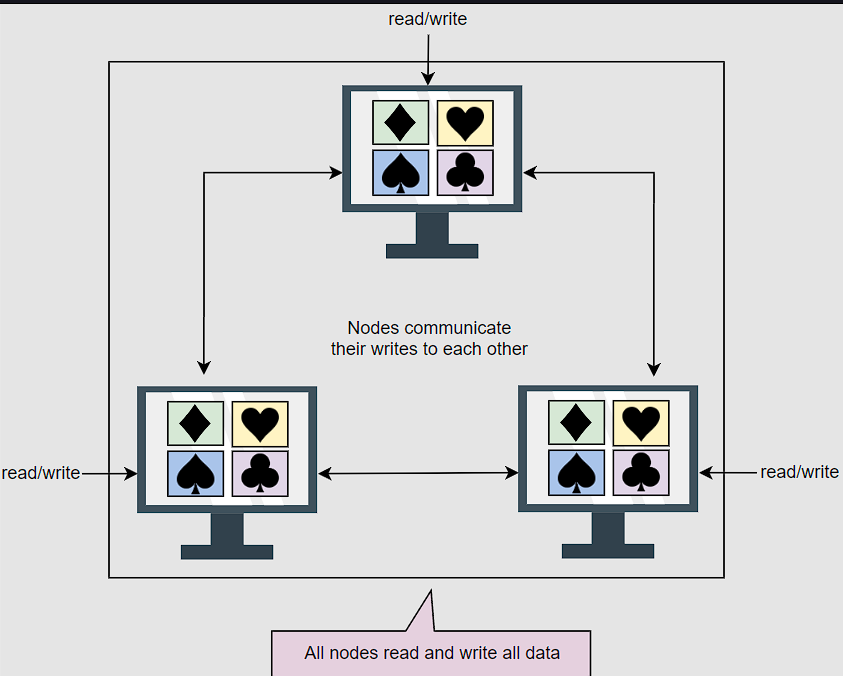
Like primary-secondary replication, this replication can also yield inconsistency. This is because when several nodes accept write requests, it may lead to concurrent writes. A helpful approach used for solving write-write inconsistency is called quorums.

Let’s suppose we have three nodes. If at least two out of three nodes are guaranteed to return successful updates, it means only one node has failed. This means that if we read from two nodes, at least one of them will have the updated version, and our system can continue working.
If we have n nodes, then every write must be updated in at least w nodes to be considered a success, and we must read from r nodes. We’ll get an updated value from reading as long as r + w > n. This is called the quorum rule.
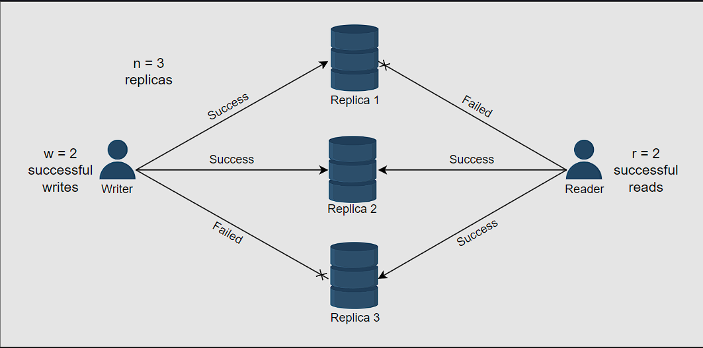
The quorum rule is used in many distributed systems, such as Cassandra, Riak, and DynamoDB. The quorum rule is also used in the Paxos algorithm, which is used for consensus in distributed systems.

## Data Partitioning
Data is an asset for any organization. Increasing data and concurrent read/write traffic to the data put scalability pressure on traditional databases. As a result, the latency and throughput are affected. Traditional databases are attractive due to their properties such as range queries, secondary indices, and transactions with the ACID properties.

At some point, a single node-based database isn’t enough to tackle the load. We might need to distribute the data over many nodes but still export all the nice properties of relational databases. In practice, it has proved challenging to provide single-node database-like properties over a distributed database.

One solution is to move data to a NoSQL-like system. However, the historical codebase and its close cohesion with traditional databases make it an expensive problem to tackle.

Organizations might scale traditional databases by using a third-party solution. But often, integrating a third-party solution has its complexities. More importantly, there are abundant opportunities to optimize for the specific problem at hand and get much better performance than a general-purpose solution.

Data partitioning (or sharding) enables us to use multiple nodes where each node manages some part of the whole data. To handle increasing query rates and data amounts, we strive for balanced partitions and balanced read/write load.

We’ll discuss different ways to partition data, related challenges, and their solutions in this lesson.

### Sharding
To divide load among multiple nodes, we need to partition the data by a phenomenon known as partitioning or sharding. In this approach, we split a large dataset into smaller chunks of data stored at different nodes on our network.

The partitioning must be balanced so that each partition receives about the same amount of data. If partitioning is unbalanced, the majority of queries will fall into a few partitions. Partitions that are heavily loaded will create a system bottleneck. The efficacy of partitioning will be harmed because a significant portion of data retrieval queries will be sent to the nodes that carry the highly congested partitions. Such partitions are known as hotspots. Generally, we use the following two ways to shard the data:

- Vertical sharding
- Horizontal sharding

#### Vertical sharding
We can put different tables in various database instances, which might be running on a different physical server. We might break a table into multiple tables so that some columns are in one table while the rest are in the other. We should be careful if there are joins between multiple tables. We may like to keep such tables together on one shard.

Often, vertical sharding is used to increase the speed of data retrieval from a table consisting of columns with very wide text or a binary large object (blob). In this case, the column with large text or a blob is split into a different table.

As shown in the figure a couple paragraphs below, the Employee table is divided into two tables: a reduced Employee table and an EmployeePicture table. The EmployePicture table has just two columns, EmployeID and Picture, separated from the original table. Moreover, the primary key EmpoloyeeID of the Employee table is added in both partitioned tables. This makes the data read and write easier, and the reconstruction of the table is performed efficiently.

Vertical sharding has its intricacies and is more amenable to manual partitioning, where stakeholders carefully decide how to partition data. In comparison, horizontal sharding is suitable to automate even under dynamic conditions.
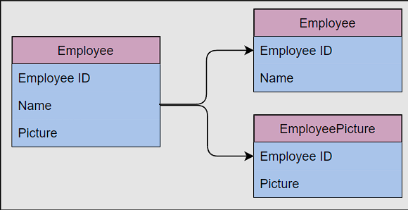

#### Horizontal sharding
At times, some tables in the databases become too big and affect read/write latency. Horizontal sharding or partitioning is used to divide a table into multiple tables by splitting data row-wise, as shown in the figure in the next section. Each partition of the original table distributed over database servers is called a shard. Usually, there are two strategies available:

1. Key-range based sharding
  In the key-range based sharding, each partition is assigned a continuous range of keys. In the following figure,horizontal partitioning on the Invoice table is performed using the key-range based sharding with Customer_Id as the partition key. The two different colored tables represent the partitions.
  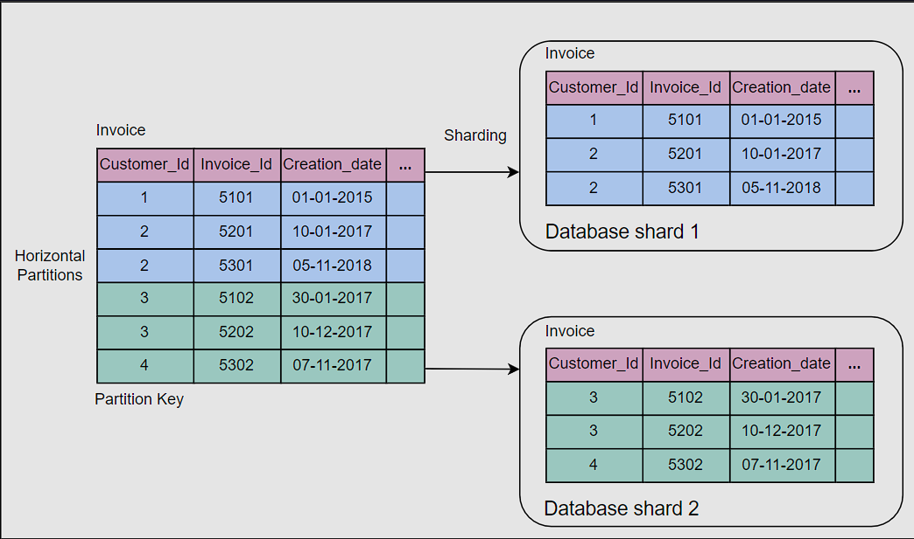
  Sometimes, a database consists of multiple tables bound by foreign key relationships. In such a case, the horizontal partition is performed using the same partition key on all tables in a relation. Tables (or subtables) that belong to the same partition key are distributed to one database shard. The following figure shows that several tables with the same partition key are placed in a single database shard:
  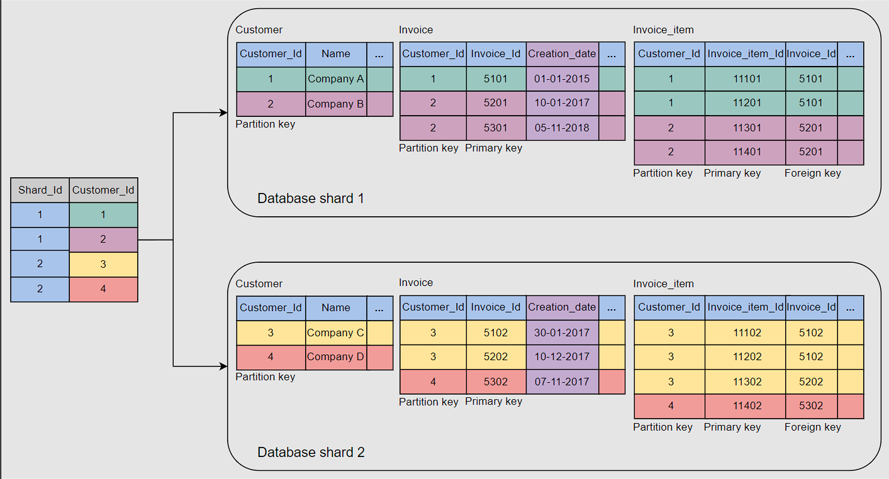

  The basic design techniques used in multi-table sharding are as follows:

  - There’s a partition key in the Customer mapping table. This table resides on each shard and stores the partition keys used in the shard. Applications create a mapping logic between the partition keys and database shards by reading this table from all shards to make the mapping efficient. Sometimes, applications use advanced algorithms to determine the location of a partition key belonging to a specific shard.

  - The partition key column, Customer_Id, is replicated in all other tables as a data isolation point. It has a trade-off between an impact on increased storage and locating the desired shards efficiently. Apart from this, it’s helpful for data and workload distribution to different database shards. The data routing logic uses the partition key at the application tier to map queries specified for a database shard.

  - Primary keys are unique across all database shards to avoid key collision during data migration among shards and the merging of data in the online analytical processing (OLAP) environment.

  - The column Creation_date serves as the data consistency point, with an assumption that the clocks of all nodes are synchronized. This column is used as a criterion for merging data from all database shards into the global view when essential.
  - ##### Advantages of horizontal sharding
    - Using this method, the range-query-based scheme is easy to implement.
    - Range queries can be performed using the partitioning keys, and those can be kept in partitions in sorted order.
  - ##### Disadvantage
    - Range queries can’t be performed using keys other than the partitioning key.
    - If keys aren’t selected properly, some nodes may have to store more data due to an uneven distribution of the traffic.
 
2. Hash based sharding
  Hash-based sharding uses a hash-like function on an attribute, and it produces different values based on which attribute the partitioning is performed. The main concept is to use a hash function on the key to get a hash value and then mod by the number of partitions. Once we’ve found an appropriate hash function for keys, we may give each partition a range of hashes (rather than a range of keys). Any key whose hash occurs inside that range will be kept in that partition.
  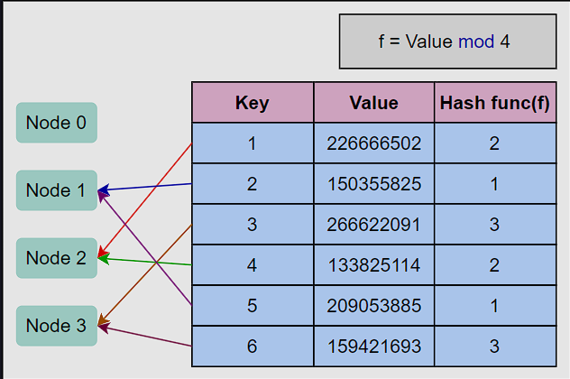
  - Advantages:
    Keys are uniformly distributed across the nodes.
  - Disadvantages:
    We can’t perform range queries with this technique. Keys will be spread over all partitions.

3. Consistant Hashing 
   Consistent hashing assigns each server or item in a distributed hash table a place on an abstract circle, called a ring, irrespective of the number of servers in the table. This permits servers and objects to scale without compromising the system’s overall performance.
   - Advantages of consistent hashing: 
     It’s easy to scale horizontally. It increases the throughput and improves the latency of the application.
   - Disadvantages of consistent hashing: Randomly assigning nodes in the ring may cause non-uniform distribution.

### Rebanlance the Partition
Query load can be imbalanced across the nodes due to many reasons, including the following:

- The distribution of the data isn’t equal.
- There’s too much load on a single partition.
- There’s an increase in the query traffic, and we need to add more nodes to keep up.We can apply the following strategies to rebalance partitions.

1. Avoid Hash mod n 
   
   Usually, we avoid the hash of a key for partitioning (we used such a scheme to explain the concept of hashing in simple terms earlier). The problem with the addition or removal of nodes in the case of hash mod n is that every node’s partition number changes and a lot of data moves. For example, assume we have hash(key) = 1235, If we have five nodes at the start, the key will start on node 1, Now, if a new node is added, the key would have to be moved to node 6 (hash(key) % 6). This would cause a lot of data to move. Instead, we can use a consistent hashing scheme. This moving of keys from one node to another makes rebalancing costly.

2. Fixed number of partitions 
   
   In this approach, the number of partitions to be created is fixed at the time when we set our database up. We create a higher number of partitions than the nodes and assign these partitions to nodes. So, when a new node is added to the system, it can take a few partitions from the existing nodes until the partitions are equally divided.  
   
   There’s a downside to this approach. The size of each partition grows with the total amount of data in the cluster since all the partitions contain a small part of the total data. If a partition is very small, it will result in too much overhead because we may have to make a large number of small-sized partitions, each costing us some overhead. If the partition is very large, rebalancing the nodes and recovering from node failures will be expensive. It’s very important to choose the right number of partitions. A fixed number of partitions is used in Elasticsearch, Riak, and many more.

3. Dynamic partitioning 
   
   In this approach, when the size of a partition reaches the threshold, it’s split equally into two partitions. One of the two split partitions is assigned to one node and the other one to another node. In this way, the load is divided equally. The number of partitions adapts to the overall data amount, which is an advantage of dynamic partitioning.However, there’s a downside to this approach. It’s difficult to apply dynamic rebalancing while serving the reads and writes. This approach is used in HBase and MongoDB.

4. Partition proportionally to nodes 
   
   In this approach, the number of partitions is proportionate to the number of nodes, which means every node has fixed partitions. In earlier approaches, the number of partitions was dependent on the size of the dataset. That isn’t the case here. While the number of nodes remains constant, the size of each partition rises according to the dataset size. However, as the number of nodes increases, the partitions shrink. When a new node enters the network, it splits a certain number of current partitions at random, then takes one half of the split and leaves the other half alone. This can result in an unfair split. This approach is used by Cassandra and Ketama.

### Partitioning and secondary indexes
We’ve discussed key-value data model partitioning schemes in which the records are retrieved with primary keys. But what if we have to access the records through secondary indexes? Secondary indexes are the records that aren’t identified by primary keys but are just a way of searching for some value. For example, the above illustration of horizontal partitioning contains the customer table, searching for all customers with the same creation year.

We can partition with secondary indexes in the following ways.

#### Partition secondary indexes by document
Each partition is fully independent in this indexing approach. Each partition has its secondary indexes covering just the documents in that partition. It’s unconcerned with the data held in other partitions. If we want to write anything to our database, we need to handle that partition only containing the document ID we’re writing. It’s also known as the local index. In the illustration below, there are three partitions, each having its own identity and data. If we want to get all the customer IDs with the name John, we have to request from all partitions.

However, this type of querying on secondary indexes can be expensive. As a result of being restricted by the latency of a poor-performing partition, read query latencies may increase.
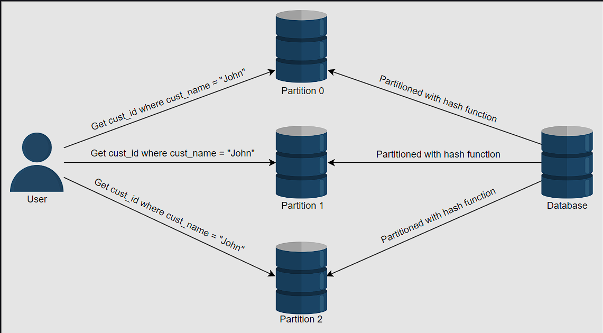

#### Partition secondary indexes by term
Instead of creating a secondary index for each partition (a local index), we can make a global index for secondary terms that encompasses data from all partitions.

In the illustration below, we create indexes on names (the term on which we’re partitioning) and store all the indexes for names on separated nodes. To get the cust_id of all the customers named John, we must determine where our term index is located. The index 0 contains all the customers with names starting with “A” to “M.” The index 1 includes all the customers with names beginning with “N” to “Z.” Because John lies in index 0, we fetch a list of cust_id with the name John from index 0.

Partitioning secondary indexes by the term is more read-efficient than partitioning secondary indexes by the document. This is because it only accesses the partition that contains the term. However, a single write in this approach affects multiple partitions, making the method write-intensive and complex.
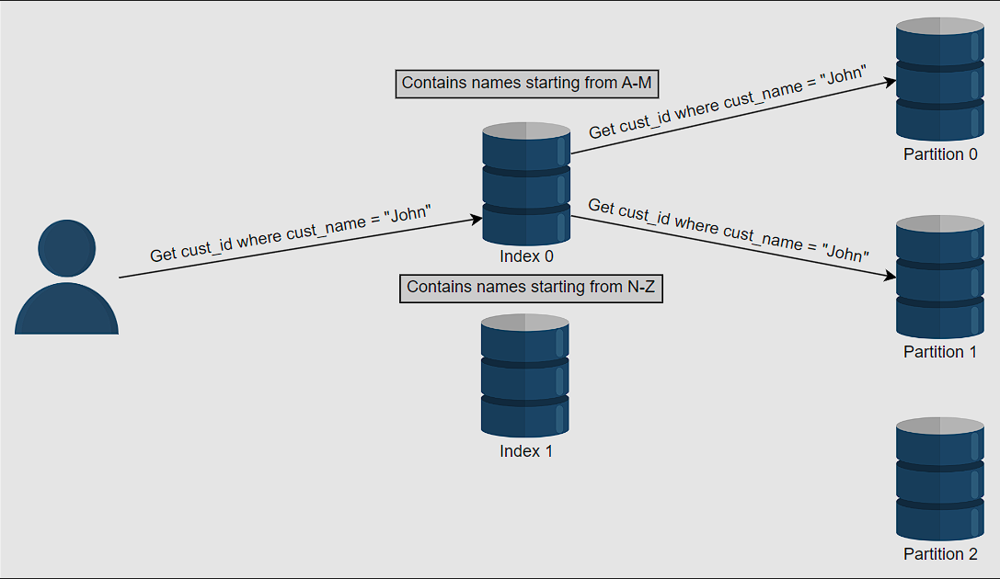

## Request Routing
We’ve learned how to partition our data. However, one question arises here: How does a client know which node to connect to while making a request? The allocation of partitions to nodes varies after rebalancing. If we want to read a specific key, how do we know which IP address we need to connect to read?

This problem is also known as service discovery. Following are a few approaches to this problem:

- Allow the clients to request any node in the network. If that node doesn’t contain the requested data, it forwards that request to the node that does contain the related data.

- The second approach contains a routing tier. All the requests are first forwarded to the routing tier, and it determines which node to connect to fulfill the request.

- The clients already have the information related to partitioning and which partition is connected to which node. So, they can directly contact the node that contains the data they need.

In all of these approaches, the main challenge is to determine how these components know about updates in the partitioning of the nodes.

### Zookeeper
To track changes in the cluster, many distributed data systems need a separate management server like ZooKeeper. Zookeeper keeps track of all the mappings in the network, and each node connects to ZooKeeper for the information. Whenever there’s a change in the partitioning, or a node is added or removed, ZooKeeper gets updated and notifies the routing tier about the change. HBase, Kafka and SolrCloud use ZooKeeper.

For all current distributed systems, partitioning has become the standard protocol. Because systems contain increasing amounts of data, partitioning the data makes sense since it speeds up both writes and reads. It increases the system’s availability, scalability, and performance.

## Tradeoffs in database

### Which is the best database sharding approach?
Both horizontal and vertical sharding involve adding resources to our computing infrastructure. Our business stakeholders must decide which is suitable for our organization. We must scale our resources accordingly for our organization and business to grow, to prevent downtime, and to reduce latency. We can scale these resources through a combination of adjustments to CPU, physical memory requirements, hard disk adjustments, and network bandwidth.

The following sections explain the pros and cons of no sharding versus sharding.

#### Advantages and disadvantages of a centralized database

- Advantage 
   
  1. Data maintenance, such as updating and taking backups of a centralized database, is easy.

  2. Centralized databases provide stronger consistency and ACID transactions than distributed databases.

  3. Centralized databases provide a much simpler programming model for the end programmers as compared to distributed databases.

  4. It’s more efficient for businesses to have a small amount of data to store that can reside on a single node.

- Disadvantages
  1. A centralized database can slow down, causing high latency for end users, when the number of queries per second accessing the centralized database is approaching single-node limits.
  2. A centralized database has a single point of failure. Because of this, its probability of not being accessible is much higher.

#### Advantages and disadvantages of distributed databases

- Advantages
  1. t’s fast and easy to access data in a distributed database because data is retrieved from the nearest database shard or the one frequently used.
  2. Data with different levels of distribution transparency can be stored in separate places.
  3. Intensive transactions consisting of queries can be divided into multiple optimized subqueries, which can be processed in a parallel fashion.

- Disadvantages
  1. Sometimes, data is required from multiple sites, which takes more time than expected.

  2. Relations are partitioned vertically or horizontally among different nodes. Therefore, operations such as joins need to reconstruct complete relations by carefully fetching data. These operations can become much more expensive and complex.

  3. It’s difficult to maintain consistency of data across sites in the distributed database, and it requires extra measures.

  4. Updations and backups in distributed databases take time to synchronize data.

#### Query optimization and processing speed in a distributed database  

A transaction in the distributed database depends on the type of query, number of sites (shards) involved, communication speed, and other factors, such as underline hardware and the type of database used. However, as an example, let’s assume a query accessing three tables, Store, Product, and Sales, residing on different sites.

The number of attributes in each table is given in the following figure:
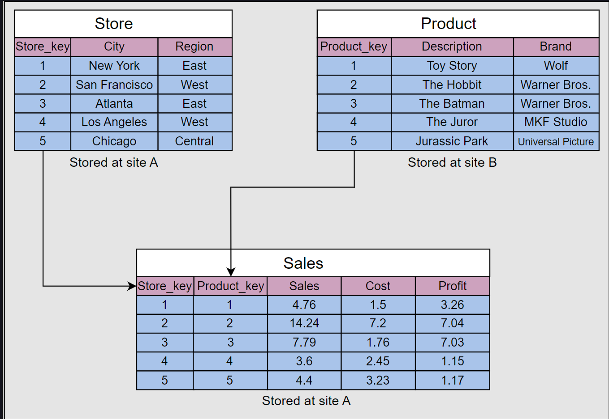  
Let’s assume the distribution of both tables on different sites is the following:

- The Store table has 10,000 tuples stored at site A.
- The Product table has 100,000 tuples stored at site B.
- The Sales table has one million tuples stored at site A.

```sql
Select Store_key from (Store JOIN Sales JOIN Product)
where Region= 'East' AND Brand='Wolf';
```
The above query performs the join operations on the Store, Sales, and Product tables and retrieves the Store_key values from the table generated in the result of join operations.

Next, assume every stored tuple is 200 bits long. That’s equal to 25 Bytes. Furthermore, estimated cardinalities of certain intermediate results are as follows:

The number of the Wolf brand is 10.
The number of East region stores is 3000 (since there are 10,000 rows in the store table, and 3000 have region as east).
Communication assumptions are the following:
- Data rate = 50M bits per second 
- Access delay = 0.1 second

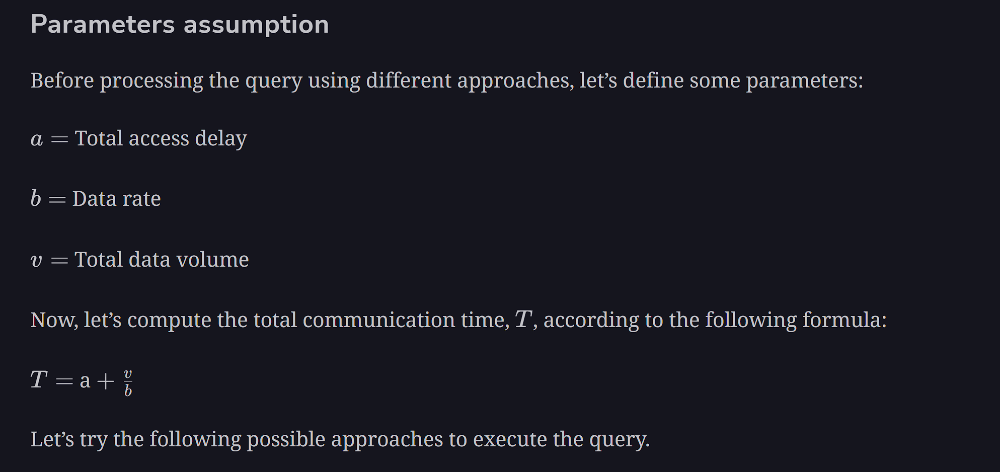
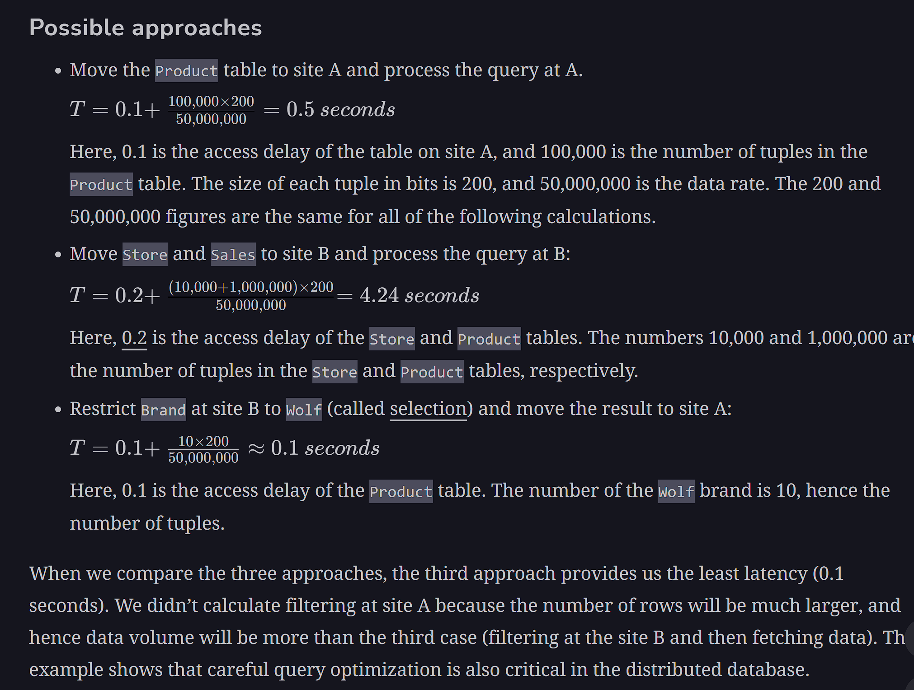