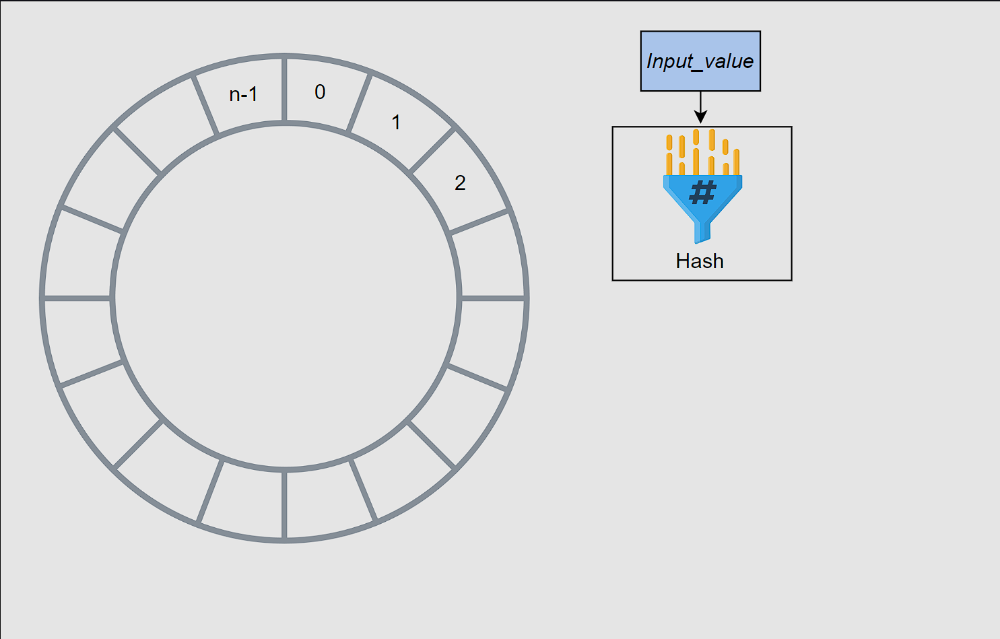
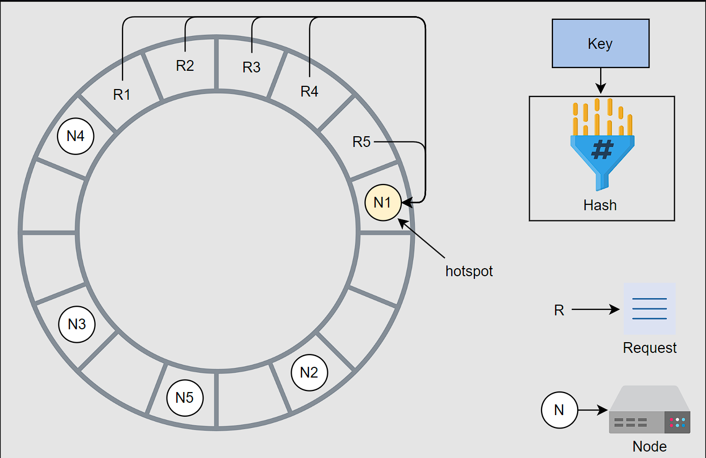
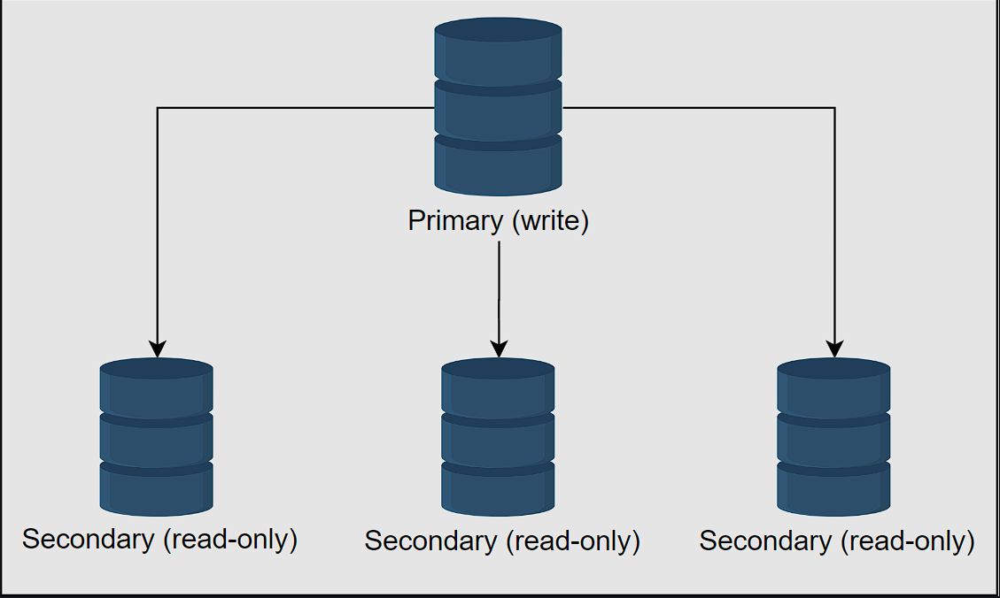
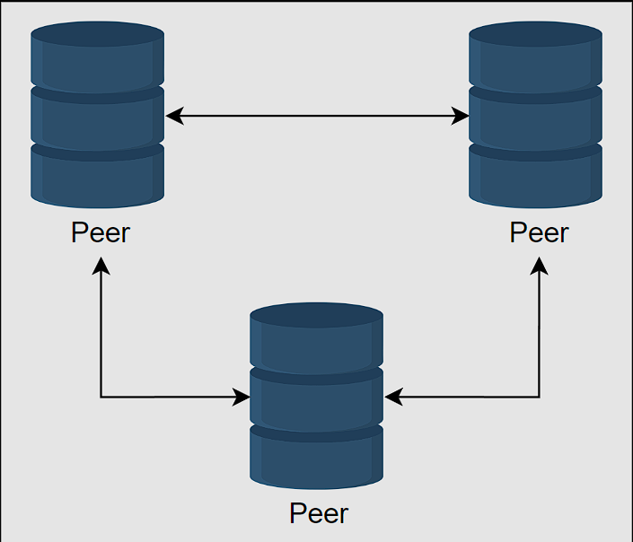
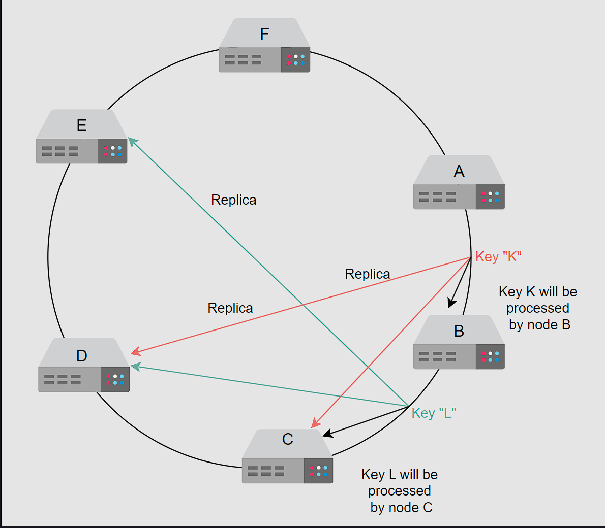

# KV store
Key-value stores are distributed hash tables (DHTs). A key is generated by the hash function and should be unique. In a key-value store, a key binds to a specific value and doesn’t assume anything about the structure of the value. A value can be a blob, image, server name, or anything the user wants to store against a unique key. 

Usually, it’s preferred to keep the size of value relatively smaller (KB to MB). We can put large data in the blob store and put links to that data in the value field. Key-value stores are useful in many situations, such as storing user sessions in a web application and building NoSQL databases. 

It’s challenging to scale traditional databases with strong consistency and high availability in a distributed environment. Many real-world services like Amazon, Facebook, Instagram, Netflix, and many more use primary-key access to a data store instead of traditional online transaction processing (OLTP) databases. Examples of key-value store usage include bestseller lists, shopping carts, customer preferences, session management, sales rank, and product catalogs.
Note: Many applications might not require a rich 

programming model provided by a traditional relational database management system (RDBMS). Using RDBMS for such applications is often expensive in terms of cost and performance.

## Design of a key-value store

### Functional requirements
- Configurable service: Some applications might have a tendency to trade strong consistency for higher availability. We need to provide a configurable service so that different applications could use a range of consistency models. We need tight control over the trade-offs between availability, consistency, cost-effectiveness, and performance.

- Ability to always write: The applications should always have the ability to write into the key-value storage. If the user wants strong consistency, this requirement might not always be fulfilled due to the implications of the CAP theorem.

- Hardware heterogeneity: The system shouldn’t have distinguished nodes. Each node should be functionally able to do any task. Though servers can be heterogeneous, newer hardware might be more capable than older ones.

### non-functional requirements
- Scalable: Key-value stores should run on tens of thousands of servers distributed across the globe. Incremental scalability is highly desirable. We should add or remove the servers as needed with minimal to no disruption to the service availability. Moreover, our system should be able to handle an enormous number of users of the key-value store.

- Available: We need to provide continuous service, so availability is very important. This property is configurable. So, if the user wants strong consistency, we’ll have less availability and vice versa.

- Fault tolerance: The key-value store should operate uninterrupted despite failures in servers or their components.

### API
- get(key): We return the associated value on the basis of the parameter key. When data is replicated, it locates the object replica associated with a specific key that’s hidden from the end user. It’s done by the system if the store is configured with a weaker data consistency model. For example, in eventual consistency, there might be more than one value returned against a key.
- put(key, value): It stores the value associated with the key. The system automatically determines where data should be placed. Additionally, the system often keeps metadata about the stored object. Such metadata can include the version of the object.

The key is often a primary key in a key-value store, while the value can be any arbitrary binary data.

Note: Dynamo uses MD5 hashes on the key to generate a 128-bit identifier. These identifiers help the system determine which server node will be responsible for this specific key.

### Add Scalability
Let’s start with one of the core design requirements: scalability. We store key-value data in storage nodes. With a change in demand, we might need to add or remove storage nodes. It means we need to partition data over the nodes in the system to distribute the load across all nodes.

For example, let’s consider that we have four nodes, and we want 25% of the requests to go to each node to balance the load equally. The traditional way to solve this is through the modulus operator. Each request that arrives has a key associated with it. When a request comes in, we calculate the hash of they key. Then, we find the remainder by taking the modulus of the hashed value with the number of nodes m. The remainder value x is the node number, and we send the request to that node to process it.

The following slides explain this process:
We want to add and remove nodes with minimal change in our infrastructure. But in this method, when we add or remove a node, we need to move a lot of keys. This is inefficient. For example, node 2 is removed, and suppose for the same key, the new server to process a request will be node 1 because 10%3=1. Nodes hold information in their local caches, like keys and their values. So, we need to move that request’s data to the next node that has to process the request. But this replication can be costly and can cause high latency.

Next, we’ll learn how to copy data efficiently.
#### Consistent hashing
Consistent hashing is an effective way to manage the load over the set of nodes. In consistent hashing, we consider that we have a conceptual ring of hashes from 
0 to N-1, where N is the number of available hash values. We use each node’s ID, calculate its hash, and map it to the ring. We apply the same process to requests. Each request is completed by the next node that it finds by moving in the clockwise direction in the ring.

Whenever a new node is added to the ring, the immediate next node is affected. It has to share its data with the newly added node while other nodes are unaffected. It’s easy to scale since we’re able to keep changes to our nodes minimal. This is because only a small portion of overall keys need to move. The hashes are randomly distributed, so we expect the load of requests to be random and distributed evenly on average on the ring.

The primary benefit of consistent hashing is that as nodes join or leave, it ensures that a minimal number of keys need to move. However, the request load isn’t equally divided in practice. Any server that handles a large chunk of data can become a bottleneck in a distributed system. That node will receive a disproportionately large share of data storage and retrieval requests, reducing the overall system performance. As a result, these are referred to as hotspots.

As shown in the figure below, most of the requests are between the N4 and N1 nodes. Now, N1 has to handle most of the requests compared to other nodes, and it has become a hotspot. That means non-uniform load distribution has increased load on a single server.

We’ll use virtual nodes to ensure a more evenly distributed load across the nodes. Instead of applying a single hash function, we’ll apply multiple hash functions onto the same key.

Let’s take an example. Suppose we have three hash functions. For each node, we calculate three hashes and place them into the ring. For the request, we use only one hash function. Wherever the request lands onto the ring, it’s processed by the next node found while moving in the clockwise direction. Each server has three positions, so the load of requests is more uniform. Moreover, if a node has more hardware capacity than others, we can add more virtual nodes by using additional hash functions. This way, it’ll have more positions in the ring and serve more requests.

- Advantages of virtual nodes
  1. If a node fails or does routine maintenance, the workload is uniformly distributed over other nodes. For each newly accessible node, the other nodes receive nearly equal load when it comes back online or is added to the system.
  2. It’s up to each node to decide how many virtual nodes it’s responsible for, considering the heterogeneity of the physical infrastructure. For example, if a node has roughly double the computational capacity as compared to the others, it can take more load.

### Data replication
We have various methods to replicate the storage. It can be either a primary-secondary relationship or a peer-to-peer relationship.

#### Primary-secondary replication
In a primary-secondary approach, one of the storage areas is primary, and other storage areas are secondary. The secondary replicates its data from the primary. The primary serves the write requests while the secondary serves read requests. After writing, there’s a lag for replication. Moreover, if the primary goes down, we can’t write into the storage, and it becomes a single point of failure.

#### Peer-to-peer replication
In the peer-to-peer approach, all involved storage areas are primary, and they replicate the data to stay updated. Both read and write are allowed on all nodes. Usually, it’s inefficient and costly to replicate in all 
n nodes. Instead, three or five is a common choice for the number of storage nodes to be replicated.

We’ll use a peer-to-peer relationship for replication. We’ll replicate the data on multiple hosts to achieve durability and high availability. Each data item will be replicated at n hosts, where n is a parameter configured per instance of the key-value store. For example, if we choose n to be 5, it means we want our data to be replicated to five nodes.

Each node will replicate its data to the other nodes. We’ll call a node coordinator that handles read or write operations. It’s directly responsible for the keys. A coordinator node is assigned the key “K.” It’s also responsible for replicating the keys to n−1 successors on the ring (clockwise). These lists of successor virtual nodes are called preference lists. To avoid putting replicas on the same physical nodes, the preference list can skip those virtual nodes whose physical node is already in the list.

Let’s consider the illustration given below. We have a replication factor, n, set to 3. For the key “K,” the replication is done on the next three nodes: B, C, and D. Similarly, for key “L,” the replication is done on nodes C, D, and E.

In the context of the CAP theorem, key-value stores can either be consistent or be available when there are network partitions. For key-value stores, we prefer availability over consistency. It means if the two storage nodes lost connection for replication, they would keep on handling the requests sent to them, and when the connection is restored, they’ll sync up. In the disconnected phase, it’s highly possible for the nodes to be inconsistent. So, we need to resolve such conflicts. In the next lesson, we’ll learn a concept to handle inconsistencies using the versioning of our data.

### Data versioning
When network partitions and node failures occur during an update, an object’s version history might become fragmented. As a result, it requires a reconciliation effort on the part of the system. It’s necessary to build a way that explicitly accepts the potential of several copies of the same data so that we can avoid the loss of any updates. It’s critical to realize that some failure scenarios can lead to multiple copies of the same data in the system. So, these copies might be the same or divergent. Resolving the conflicts among these divergent histories is essential and critical for consistency purposes. 

To handle inconsistency, we need to maintain causality between the events. We can do this using the timestamps and update all conflicting values with the value of the latest request. But time isn’t reliable in a distributed system, so we can’t use it as a deciding factor.

Another approach to maintaining causality effectively is by using vector clocks. A vector clock is a list of (node, counter) pairs. There’s a single vector clock for every version of an object. If two objects have different vector clocks, we’re able to tell whether they’re causally related or not (more on this in a bit). Unless one of the two changes is reconciled, the two are deemed at odds.

#### Modify the API
We talked about how we can decide if two events are causally related or not using a vector clock value. For this, we need information about which node performed the operation before and what its vector clock value was. This is the context of an operation. So, we’ll modify our API design as follows.

The API call to get a value should look like this:
- GET(key) → (value, context) We return an object or a collection of conflicting objects along with a context. The context holds encoded metadata about the object, including details such as the object’s version
- put(key, context, value) The function finds the node where the value should be placed on the basis of the key and stores the value associated with it. The context is returned by the system after the get operation. If we have a list of objects in context that raises a conflict, we’ll ask the client to resolve it. To update an object in the key-value store, the client must give the context. We determine version information using a vector clock by supplying the context from a previous read operation. If the key-value store has access to several branches, it provides all objects at the leaf nodes, together with their respective version information in context, when processing a read request. Reconciling disparate versions and merging them into a single new version is considered an update.